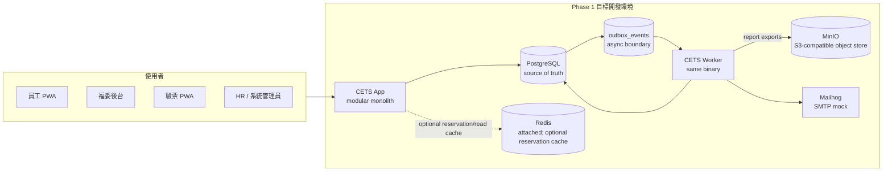
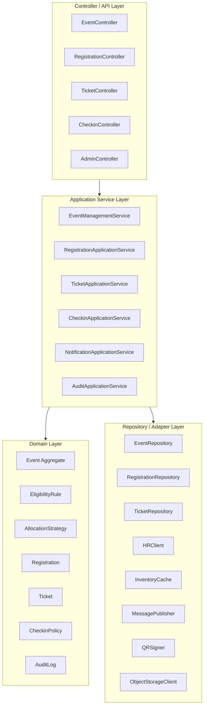
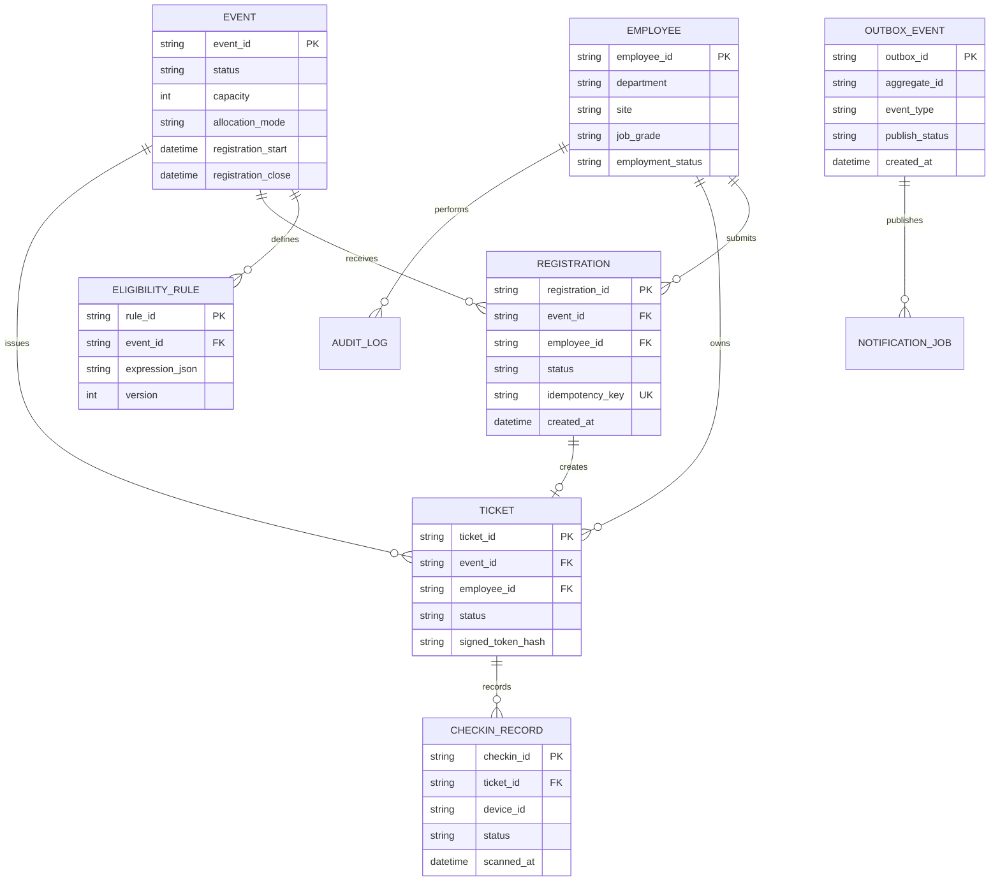
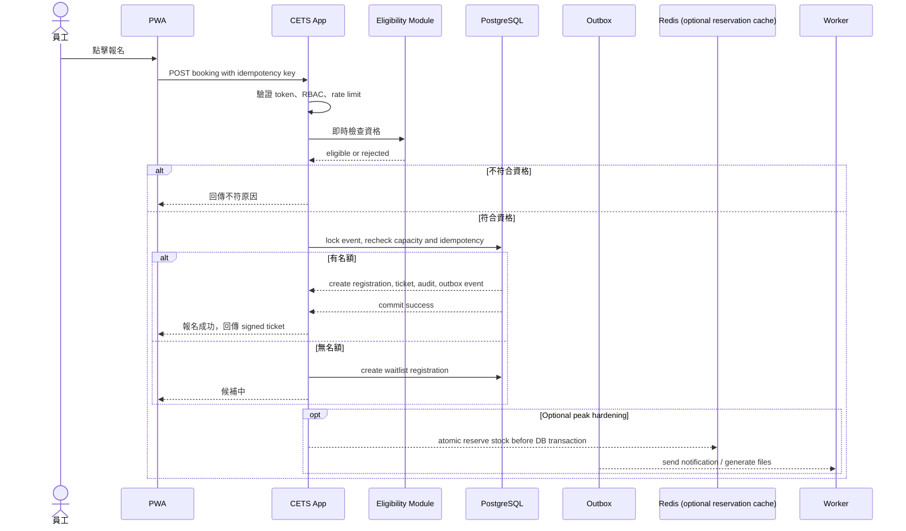
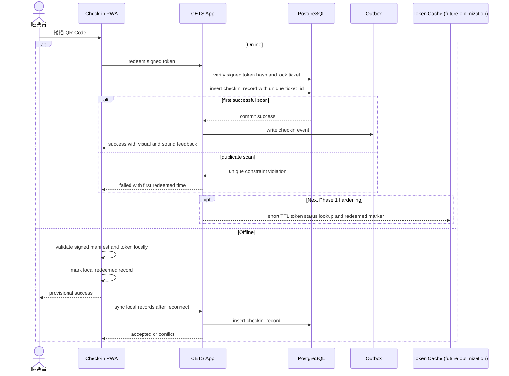

# 企業員工活動票務與現場驗票系統架構設計

> 本文件與 repo root 的 `AGENTS.md` 是目前架構與實作準則來源。Phase 1 採用 Docker Compose + modular monolith 快速交付；Phase 2 採 process-first 演進；Phase 3 先以單機 Docker Compose 模擬高可用與可觀測性，再依量測證據決定是否升級 container platform、Kafka 或微服務。

---

## 1. 文件定位與設計目標

本系統服務大型企業內部員工、福委 / 活動主辦、驗票員與 HR / 系統管理員。核心目標是讓福委能發布活動、設定資格、處理報名與配票，員工能取得電子票券，現場能快速且不可重複地完成 QR Code 驗票。

本文件刻意避免把 Phase 1 包裝成完整分散式系統。短期展示重點是：

- 用 Docker Compose 建立可重現的 Go app + backing services 本地開發環境。
- 用 modular monolith 保留清楚 domain boundary，降低早期部署與除錯成本。
- 目前已用 PostgreSQL transaction、row lock、unique constraint 與 idempotency key 處理防超賣與重複請求；Redis reservation gate 是 Phase 2 前可選的尖峰優化，不是 Phase 1 production blocker。
- 目前 React SPA production gate 覆蓋 ticket / check-in / offline sync / reporting / audit 核心流程，並由同一 binary 的 worker 消費 PostgreSQL `outbox_events`。
- 用 12-Factor 原則說明設定、日誌、port binding、backing services 與 dev/prod parity。

---

## 2. 架構原則

| 原則 | Phase 1 落地方式 |
| --- | --- |
| Spec-first | 需求、容量估算、分階段演進與風險邊界需在本文件與 `AGENTS.md` 內維護；實作前先讓文件與 acceptance criteria 一致。 |
| Modular Monolith First | Event、Eligibility、Registration、Ticket、Check-in、Notification、Reporting 是同一應用內的模組，不是獨立部署單位。 |
| Docker Compose First | `services/api/deploy/compose.yaml` 作為本地開發入口；目前啟動 Go app 與 backing services，worker 邊界保留在同一 codebase。Phase 2 notification isolation 可用 `services/api/deploy/compose.worker-isolation.yaml` overlay 在本地/CI 驗證多個 same-binary worker process。 |
| 12-Factor | 設定走環境變數、服務以 port binding 對外、日誌寫 stdout、狀態放 backing services。 |
| Database as Source of Truth | 目前 business flow 以 PostgreSQL transaction / unique constraint 為準；Redis 不得成為 committed booking truth。 |
| Async Where Safe | 核心 booking / ticket / check-in 先完成 DB transaction；notification、report export 等 side effects 透過 PostgreSQL `outbox_events` 與 same-binary worker 非同步處理。 |
| Evolution by Bottleneck | Phase 2/3 只有在 Registration、Notification、Reporting、Check-in 出現獨立擴容或故障隔離需求時才拆。 |

---

## 3. Phase Roadmap

| Phase | 架構選擇 | 容量目標 | 重點 |
| --- | --- | --- | --- |
| Phase 1 production | Docker Compose + modular monolith + PostgreSQL；Redis / MinIO / Mailhog 作為 attached backing services；same-binary worker 消費 PostgreSQL outbox | 約 36 App RPS、5 Booking TPS、320 concurrent users | 防超賣、離線驗票邊界、通知重試、報表匯出、Playwright/k6 production gate。 |
| Phase 2 成長期 (process-first) | 保留 Phase 1 modular monolith；以同一 Go binary 拆分 process：`app` (HTTP) + 多個 same-binary worker process by kind (`notification`、`projection`、`compensation`、`export`)；Redis 作為 booking pre-admission gate，reservation cleanup 歸在 `compensation` kind；PostgreSQL 仍是 booking / ticket / check-in / audit 的 final truth；Reporting 由 outbox-derived projection 提供 read model | 約 270 App RPS、35 Booking TPS、2,400 concurrent users | 尖峰報名削峰 (Redis pre-admission + idempotency)、worker kind isolation、reporting read model + freshness contract、ops 控制平面；Registration / Notification / Reporting 是否獨立部署為 deferred decision-gate，需 `docs/specs/phase2-scale-hardening.md` §2 證據才能升級。 |
| Phase 3 高流量 | 先用 Docker Compose 單機模擬 edge/gateway/frontend/backend 3-replica stateless HA 與 LGTM 可觀測性；production cross-AZ、DB failover、container platform 與服務拆分仍需後續證據 | 約 1,000 App RPS、120 Booking TPS、10,000 concurrent users | 多入口驗票、高可用演練、logs/metrics/traces/profiles/node graph、分區與營運成熟度。 |

> Phase 2 預設仍是 “one codebase, process-first evolution”。Kafka、Kubernetes、service mesh、cross-region HA、完整微服務在 Phase 2 一律視為 deferred decision-gate topics — 不列為 Phase 2 必交付，docs guard (`TestPhase2DocsDoNotClaimDeferredInfraIsRequired`) 會在 docs 出現「Phase 2 已完成 / 已導入 / 已落地」等語言時失敗。Phase 2 acceptance matrix 與 non-goals 詳見 `docs/specs/phase2-scale-hardening.md`；hot-path / async / reporting / ops 子規格見 `docs/specs/phase2-ws{1,2,3,4,5}-*.md`。

---

## 4. Phase 1 系統總覽

Phase 1 的核心執行單位是一個 Go modular monolith app。應用內部以模組分層，外部依賴由 Docker Compose 啟動並透過環境變數注入。現階段 business flow 已實際連到 PostgreSQL；Redis 已作為 attached backing service 啟動但不參與 committed booking truth；MinIO 透過 S3-compatible adapter 支援 report export；Mailhog 已透過同一 binary 的 worker 消費 PostgreSQL `outbox_events` 進行本地通知投遞。

### 4.1 Compose 服務規劃

目前已設定的 Compose 服務是 `app`、`worker`、`postgres`、`redis`、`minio` 與 `mailhog`。Phase 1 使用 PostgreSQL `outbox_events` 作為可靠佇列邊界；worker 與 app 使用同一份映像，只透過啟動 command 區分 process type。Phase 2 本地/CI 可加上 `compose.worker-isolation.yaml` 與 `worker-isolation` profile，將 `notification`、`projection`、`compensation`、`export` 分成四個 same-binary worker process；預設 `compose.yaml` 仍保留單一 all-kinds worker 以維持 Phase 1 parity。

| Compose service | 用途 | 12-Factor 對應 | Current connection status |
| --- | --- | --- | --- |
| `app` | Go modular monolith；對外 HTTP API 與 React SPA；以 `APP_PORT` port binding 對外。 | Port binding、stateless process、logs to stdout。 | 已啟動並服務 `/`, `/user/events`, `/admin/demo`, `/healthz`, `/readyz` 與 demo API；舊 demo routes 保留為 SPA aliases。 |
| `postgres` | 報名、票券、核銷、audit log、outbox 的 source of truth。 | Backing service via `DATABASE_URL`。 | 已由 app 透過 `DATABASE_URL` 連線；`/readyz` 以 PostgreSQL connectivity 判定 readiness。 |
| `redis` | 後續熱門活動名額 reservation、idempotency key、短 TTL cache。 | Backing service via `REDIS_URL`。 | 已 healthcheck 並作為 Compose dependency；Phase 1 committed booking truth 仍只用 PostgreSQL。 |
| `minio` | 本地 S3-compatible object storage，儲存 report export artifacts；未來可擴充活動圖片、附件與票券檔案。 | Backing service via `OBJECT_STORAGE_*`。 | 已由 worker 的 object-storage adapter boundary 使用；local adapter 指向 MinIO。 |
| `mailhog` | 本地 mock notification provider，避免開發時誤發真實 Email。 | Backing service via `MAILER_*`。 | 已由 worker 透過 SMTP adapter 投遞通知；suppression、retry、dead-letter 與 crash recovery 由 worker tests / production gate 覆蓋。 |
| `worker` | 消費 PostgreSQL outbox，建立站內 / Email delivery 記錄、透過 Mailhog 投遞，並生成 report export artifact。 | Process model、one codebase many process types。 | 已在 Compose 中以同一映像啟動；retry、dead-letter、idempotency、suppression 與 report export failure 由 worker tests 覆蓋。 |

### 4.2 Compose 操作約定

- `services/api/deploy/compose.yaml` 作為本地開發與 mentor demo 的主要入口。
- `services/api/deploy/compose.phase3-ha.yaml` 是 Phase 3 本機高可用模擬入口；active deployment assets 只維持 Docker Compose。Kubernetes / equivalent container platform 保留為 production decision gate，不在本地 Phase 3 模擬中維護主動部署範本。
- `services/api/deploy/.env.example` 作為環境變數模板；`services/api/deploy/.env` 可本地使用但不得放入真實 secrets。
- app 與 worker 使用同一份映像與同一份設定來源，只是啟動 command 不同。
- app 提供 `health` / `ready` endpoint；Compose 使用 `healthcheck` 與 `depends_on: service_healthy` 等待 PostgreSQL / Redis ready，但 business readiness 目前只驗證 PostgreSQL。
- 所有服務日誌輸出到 stdout / stderr，由 `docker compose --env-file services/api/deploy/.env -f services/api/deploy/compose.yaml logs` 觀察。
- migration、seed、修復腳本以 one-off admin process 執行，例如未來可用 `docker compose --env-file services/api/deploy/.env -f services/api/deploy/compose.yaml run --rm app <migration command>`。

### 4.3 Phase 1 Connectivity Acceptance

- `GET /metrics` exposes Prometheus-style operational metrics on the app port. The current Phase 2 slice includes HTTP RED metrics by route pattern / method / status class, PostgreSQL pool acquire wait counters, current lock-waiting sessions, and outbox backlog / oldest-lag gauges. Route labels must use patterns such as `/api/v1/events/{event_id}` rather than raw IDs or tokens.
- The optional Compose `observability` profile starts Prometheus, VictoriaMetrics, Alertmanager, Grafana, blackbox exporter, Redis exporter, node exporter, cAdvisor, Loki, Promtail, Tempo, and Pyroscope from `services/api/deploy/observability/` so reviewers can inspect RED, DB pool/lock, outbox lag, HTTP boundary probe signals, Redis backing-service health, USE host/container resource panels, short-term and long-term metric storage, app/worker stdout logs, opt-in app traces, and opt-in app profiles without adding required production backing services. Prometheus keeps a short local TSDB, remote-writes to the optional VictoriaMetrics container, and evaluates 5-minute RED/lag rollup recording rules for lower-granularity trend review. Prometheus loads starter SLO alert rules for HTTP 5xx error rate, P99 latency, DB pool acquire wait, DB lock waits, outbox lag, and metrics scrape failures, then routes them to the local Alertmanager review receiver. This is review/demo alert routing only; production paging or PagerDuty integration still requires a secret-managed receiver. Black-box probes target `/`, `/healthz`, and `/readyz`; they do not call product APIs or booking/check-in flows.
- `services/api/deploy/reference/kubernetes-observability/` contains reference-only kube-state-metrics and Prometheus scrape examples for a future container-platform decision gate. These files are not active deployment assets, are not loaded by Compose, and must not become product runtime dependencies.

- `GET /readyz` 回 200 代表 app 已透過 `DATABASE_URL` 連到 PostgreSQL；PostgreSQL 停止時 `/readyz` 必須回 503。
- `docker compose --env-file services/api/deploy/.env -f services/api/deploy/compose.yaml ps` 代表 Redis、MinIO、Mailhog 已作為 local backing services 啟動；production gate 還必須通過 app/worker behavior tests。
- Redis 目前是 attached resource 與 future reservation/read cache；MinIO 與 Mailhog 已分別透過 report export object-store adapter 與 worker SMTP adapter 進入 business flow。
- worker 已在 Compose 中啟動並消費 `outbox_events`；production 完成門檻是證明 crash recovery、preference suppression、dead-letter 與重試不會產生重複投遞。

---

## 5. Application Architecture

Phase 1 不以部署單位切分，而是以 application module 切分。controller 只處理輸入輸出與授權，application service 協調 use case，domain layer 保存商業規則，repository / adapter 包住外部依賴。

### 5.1 模組職責

| Module | Responsibility | 對應需求 | 測試重點 |
| --- | --- | --- | --- |
| Auth & RBAC | 驗證 SSO token、角色授權、session 管理。 | FR-AUTH | 權限矩陣、token 過期、敏感操作拒絕。 |
| Event Management | 活動 CRUD、狀態機、版本、附件。 | FR-EVENT | 狀態轉移、版本紀錄、附件限制。 |
| Eligibility | HR 屬性同步、條件組合、即時資格驗證。 | FR-QUAL | AND / OR / NOT 規則、HR 異動影響、0 人警示。 |
| Registration & Allocation | 報名、取消、候補、先搶先得、抽籤。 | FR-REG | 防超賣、idempotency、waitlist 遞補、抽籤可重現。 |
| Ticket | QR Code、票券狀態、離線票券顯示。 | FR-TKT | token 簽章、狀態轉移、多張票。 |
| Check-in | 線上驗票、離線驗票、多裝置同步。 | FR-CHK | 重複掃描、離線衝突、P99 latency。 |
| Notification | Email、站內訊息、模板與偏好。 | FR-NOTI | outbox 消費、重試、退訂偏好。 |
| Reporting | 即時 dashboard、匯出、歷史統計。 | FR-REPORT | read model 正確性、匯出權限、大量資料查詢。 |
| Audit & Admin | 系統參數、audit log 查詢、內部 API。 | FR-ADMIN | immutable log、查詢 filter、API scope。 |

### 5.2 模組邊界規則

- 模組之間透過 application service 或 domain interface 溝通，不直接操作彼此資料表的細節。
- 外部系統皆以 adapter 包裝：SSO、HR、Email、object storage、queue、Redis。
- 新增配票模式透過 `AllocationStrategy` 擴充，不改寫 controller 與 repository。
- 活動、報名、票券、核銷都使用明確 state machine，避免非法狀態轉移。
- Phase 1 的模組邊界必須足夠清楚，讓 Phase 2 可以拆出獨立 process / service。

---

## 6. Data Model 與一致性策略

### 6.1 核心資料模型

### 6.2 一致性邊界

| Scenario | Strategy | Tradeoff |
| --- | --- | --- |
| 同時搶最後一張票 | 目前以 PostgreSQL transaction、event row lock、unique constraint 與 commit 結果防超賣；Redis Lua reservation 是 Phase 2 前可選尖峰優化。 | 目前交易邏輯較簡單且可驗證；高尖峰前可補 Redis TTL 與 DB 失敗補償。 |
| 使用者連點或網路重送 | `idempotency_key` + unique constraint + 保存請求結果。 | 需要保存 key 與結果一段時間。 |
| DB 寫入與非同步任務 | 目前同一 transaction 寫入 business data 與 `outbox_events`；same-binary worker 以 DB lease 消費並重試。 | worker 必須 idempotent，因為事件可能重送或被 crash recovery 重新 claim。 |
| 活動列表剩餘名額 | 目前直接由 PostgreSQL 統計；Redis / cache short TTL 是後續讀取優化。 | 目前一致性較直接；接入 cache 後可能短暫不精準，送出報名前必須重新檢查。 |
| HR 資格快取 | 查詢可快取，但報名前 double-check。 | HR 異動與快取可能短暫不一致。 |
| 一票只能核銷一次 | `checkin_record.ticket_id` unique constraint，first commit wins；offline sync 保留 duplicate/conflict rows。 | 離線驗票需同步後做 conflict review。 |
| 報表 dashboard | 目前查 PostgreSQL 聚合；report export 透過 worker 產生 object-storage artifact。 | 資料量上升後需隔離 OLTP 與 reporting load。 |

---

## 7. Critical Flow

### 7.1 先搶先得報名流程

目前同步路徑完成授權、資格檢查、PostgreSQL row lock、capacity check、idempotency、registration、ticket、audit 與 outbox row 寫入。Redis reservation gate 不在 committed booking path；如需更高尖峰承載，可把 Redis Lua reservation 放到 DB transaction 前方，但 DB 仍是最終狀態。worker 已運行於同一 binary，透過 PostgreSQL `outbox_events` 進行通知與報表匯出等 side effects。

### 7.2 抽籤流程

抽籤活動不在報名瞬間爭搶 DB lock。Registration module 收集報名意願；admin allocation 以固定 seed、`event_id`、`registration_id` 排序產生可重現結果，並在同一 transaction 寫入 winners、waitlist、ticket、audit 與 outbox。

| Step | 一致性設計 |
| --- | --- |
| 收集報名 | 對 `(event_id, employee_id)` 建 unique constraint，避免同員工重複報名。 |
| 抽籤輸入 | 只讀取截止時間前、狀態為 `received` 的 registration。 |
| 隨機性 | seed 由 `event_id`、公開批次 ID 與系統密鑰產生，寫入 audit log。 |
| 結果寫入 | winners、losers、waitlist 在同一批次交易中更新，並寫入 outbox。 |
| 通知 | outbox worker 支援重試、dead-letter 與 delivery 去重；通知 provider 可由 Mailhog 換成正式 SMTP。 |

### 7.3 線上與離線驗票流程

線上模式目前直接以 PostgreSQL ticket lookup、row lock 與 `checkin_record.ticket_id` unique constraint 保證一票只成功核銷一次。Token cache 是未來查詢加速，不得取代 DB unique constraint。離線模式下，PWA 的成功狀態是 provisional，恢復連線後由伺服器判斷 first commit wins；若兩台裝置離線掃到同一張票，後同步者會變成 conflict，系統保留 `device_id`、`scanned_at` 與 `staff_id` 供追查。

---

## 8. Technology Choices

### 8.1 Phase 1 技術選型

| 類別 | 選擇 | 理由 |
| --- | --- | --- |
| Runtime | Go modular monolith | 單一靜態 binary、內建 HTTP server、清楚 transaction 邊界，適合 Phase 1 production 與後續水平擴充。 |
| Frontend | Responsive Web + PWA | 不做原生 app；支援離線票券顯示與離線驗票。 |
| Server-side TypeScript / NestJS | Not adopted in Phase 1 | 目前 production 缺口是 Go/PostgreSQL correctness、worker reliability、12-Factor config 與 gates；新增 NestJS backend 或 BFF 會增加 runtime、auth/session、Docker 與 CI surface，不能降低 Phase 1 風險。 |
| Database | PostgreSQL | 目前已連接 app，負責交易、unique constraint、row locking、audit log、outbox 與關聯查詢。 |
| Cache / Reservation | Redis | Compose 已啟動並 healthchecked；名額 reservation、idempotency key、短 TTL token cache 是 optional optimization，PostgreSQL 仍是 final truth。 |
| Object Storage | MinIO in Compose，未來可換 S3 compatible storage | Report export 已透過 S3-compatible adapter boundary 寫入 object storage；活動圖片、附件、票券 PDF 可沿用同一 adapter。 |
| Queue | PostgreSQL outbox；未來可換 Redis stream 或 lightweight broker | Same-binary worker 已消費 `outbox_events`；如改外部 queue，必須保留 DB outbox 或等價可靠交付語義。 |
| Local Dev | Docker Compose | 一鍵啟動 app 與 backing services，降低 mentor demo 與團隊 onboarding 成本。 |
| Observability | JSON logs + basic metrics + trace_id + optional local Loki/Tempo | Phase 1 先能排查報名、票券、核銷流程；Phase 2/3 再導入完整 stack。 |

### 8.2 Cloud-agnostic 對應

Phase 1 文件不把任何雲供應商作為必備前提。Compose 中的 backing services 未來可用等價託管服務替換；目前 app 已透過 `DATABASE_URL` 連到 PostgreSQL，worker 透過 `MAILER_*` 與 `OBJECT_STORAGE_*` 連到 Mailhog / MinIO，Redis 仍作為 optional reservation/read-cache resource。

| 本地 Compose | 未來託管服務範例 | 替換方式 |
| --- | --- | --- |
| PostgreSQL container | Managed PostgreSQL / RDS / Cloud SQL / Azure Database | 改 `DATABASE_URL`。 |
| Redis container | Managed Redis / ElastiCache / Memorystore | 啟用 reservation/read-cache adapter 時改 `REDIS_URL`。 |
| MinIO | S3 compatible object storage | 改 `OBJECT_STORAGE_ENDPOINT`、bucket、credential。 |
| PostgreSQL outbox / future queue | Managed queue、Kafka、RabbitMQ | Phase 1 使用 DB outbox；未來接入 queue 時改 `QUEUE_URL` 與 message adapter。 |
| Mail mock | SMTP / Email provider | 改 `MAILER_*`。 |

---

## 9. 12-Factor 對應

本文件直接列出 Phase 1 需要遵守的 12-Factor 摘要，不依賴其他文件。

| Factor | Phase 1 規範 |
| --- | --- |
| Codebase | 一個 repo 管理同一套 app code；同一 codebase 可部署到 local、staging、production。 |
| Dependencies | 依賴必須宣告在 package manifest / lockfile；容器映像不得依賴開發者本機套件。 |
| Config | 所有會因環境改變的設定走 env vars；`services/api/deploy/.env.example` 只放範例值，不放 secrets。 |
| Backing services | 目前 DB 以 `DATABASE_URL` 注入且已連接；worker 使用 `MAILER_*` 與 `OBJECT_STORAGE_*`；Redis / queue URL 是 attached resource 與 future cache/queue contract。 |
| Build / Release / Run | build 產生映像；release = image + env；run 階段只啟動 process，不重新 build。 |
| Processes | app 與 worker 都是 stateless process。session、票券、檔案、outbox / queue 狀態都必須放 backing services。 |
| Port binding | app 以 `APP_PORT` 綁定 HTTP port；前方可由 Compose port mapping 或未來 routing layer 導流。 |
| Concurrency | app / worker 可透過 process 數量水平擴充；Phase 1 先以 Compose 模擬。 |
| Disposability | process 要能快速啟動、graceful shutdown，避免中斷 in-flight booking / check-in。 |
| Dev/prod parity | 本地與未來環境使用相同類型 backing services，不以 SQLite 或 in-memory cache 取代 PostgreSQL / Redis。 |
| Logs | 應用程式輸出 JSON structured logs 到 stdout / stderr，不自行管理 log file。 |
| Admin processes | migration、seed、修復資料與抽籤批次用 one-off command，在同一 codebase 與 env 下執行。 |

---

## 10. Non-Functional Requirements

### 10.1 Availability and Fault Tolerance

| ID | Requirement | 架構含意 |
| --- | --- | --- |
| NFR-HA-01 | 一般使用端 uptime SLO ≥ 99.9%。 | Phase 1 以 stateless app 為前提；Phase 3 再以多 instance / 多 AZ 實作。 |
| NFR-HA-02 | 驗票與核銷端點 uptime SLO ≥ 99.95%。 | Check-in 流程支援離線降級；Phase 3 可獨立擴容。 |
| NFR-HA-03 | RTO ≤ 30 分鐘，RPO ≤ 5 分鐘。 | DB 備份、PITR、restore procedure 與演練需在 Phase 2/3 補齊。 |
| NFR-HA-04 | 非核心功能失效不得拖垮報名與驗票。 | 核心 booking / check-in 不依賴 Mailhog / MinIO / worker 成功；通知與報表匯出失敗必須 retry 或 dead-letter。 |

### 10.2 Scalability

| ID | Requirement | 架構含意 |
| --- | --- | --- |
| NFR-SCALE-01 | Phase 3 支援 90,000 員工規模，熱門活動約 54,000 人活躍。 | 先保留 stateless process、cache、queue、read model 與資料分區演進路徑。 |
| NFR-SCALE-02 | Phase 3 設計尖峰約 1,000 App RPS、120 Booking TPS、10,000 concurrent users。 | 熱門讀取未來走 cache；核心訂票目前用 PostgreSQL confirm，Redis reservation 是 optional peak hardening。 |
| NFR-SCALE-03 | 報名開放瞬間可吸收重試與刷新流量。 | Rate limiting、idempotency key、queue backlog 監控、必要時拆 Registration。 |
| NFR-SCALE-04 | Reporting 查詢不得影響 OLTP 訂票交易。 | Phase 2 起使用 read replica 或 analytics read model。 |

### 10.3 Performance

| Operation | P99 Latency Target | 說明 |
| --- | --- | --- |
| 活動列表瀏覽 | < 200ms | Cache 活動列表與靜態資源；未來可加 CDN / read replica。 |
| 資格查詢 | < 300ms | HR 屬性可快取；報名前必須 double-check。 |
| 報名請求 | < 500ms | 目前同步路徑做授權、資格、PostgreSQL capacity check、idempotency 與 DB transaction；Redis reservation 可作為未來尖峰保護。 |
| 現場核銷 | < 200ms | 目前線上走 signed token hash + DB unique constraint；token cache 與離線 manifest 是後續 hardening。 |
| 票券生成 | < 2s | 目前同步產生 signed ticket / QR payload；PDF / 檔案化輸出可交給 worker 與 object storage adapter。 |

---

## 11. Capacity Estimate

本系統日常流量偏低，真正瓶頸是熱門活動前 12 分鐘的集中流量。以下估算採用本文件的三階段設計模型。

| Phase | Hot Active Users | Raw App RPS | Design App RPS | Raw Booking TPS | Design Booking TPS | Concurrent Target |
| --- | ---: | ---: | ---: | ---: | ---: | ---: |
| Phase 1 | 2,000 | `2000*8*0.8/720 = 17.8` | 36 RPS | `2000*1*0.8/720 = 2.2` | 5 TPS | 320 |
| Phase 2 | 15,000 | `15000*8*0.8/720 = 133.3` | 270 RPS | `15000*1*0.8/720 = 16.7` | 35 TPS | 2,400 |
| Phase 3 | 54,000 | `54000*8*0.8/720 = 480` | 960-1,000 RPS | `54000*1*0.8/720 = 60` | 120 TPS | 10,000 |

| 情境 | Read / Write Ratio | 主要瓶頸 | 架構回應 |
| --- | --- | --- | --- |
| 日常瀏覽 | 約 95:5 | 活動列表與圖片載入 | 目前查 PostgreSQL；Cache、object storage media、未來 CDN 是 future evolution。 |
| 熱門報名前 12 分鐘 | 約 80:20，但 writes 集中在同一活動名額 | 庫存扣減、DB row lock、重試風暴 | 目前 PostgreSQL transaction confirm + idempotency key；Redis reservation、rate limiting 是 optional peak hardening。 |
| 抽籤執行 | 約 30:70 | 批次排序、結果寫入、通知事件 | deterministic seed allocation 已寫入 tickets/audit/outbox；worker 負責通知 side effects。 |
| 現場驗票 | 約 40:60 | 單票 exactly-once 核銷、多裝置同步 | 目前 DB unique constraint 與 offline sync conflict rows；short TTL token cache 是 future optimization。 |
| 報表分析 | 約 99:1 | 大範圍掃描與聚合 | Phase 2 起使用 read model 或 analytics store。 |

---

## 12. Testing Strategy

| 類別 | 測試項目 | 對應風險 |
| --- | --- | --- |
| Unit Test | Eligibility rule parser、AllocationStrategy、Ticket state machine、CheckinPolicy。 | 規則錯誤、非法狀態轉移。 |
| Integration Test | Registration + PostgreSQL transaction + outbox row、worker retry/idempotency、offline sync、report export。 | 超賣、dual-write、重複通知。 |
| E2E Test | 員工瀏覽活動、報名、取得票券；福委建立活動與資格；驗票員核銷；HR 查報表。 | Demo flow 不完整、角色流程斷裂。 |
| Load Test | Phase 1 36 RPS / 5 TPS；Phase 2 270 RPS / 35 TPS；Phase 3 1,000 RPS / 120 TPS。 | 熱門活動 latency、lock wait、queue lag。 |
| Failure Test | 目前驗證 DB unavailable / `/readyz` 503；後續接入 Redis / notification / read model 後，再測 Redis unavailable、notification provider down、read model lag。 | 確認 graceful degradation 與 recovery。 |
| Security Test | RBAC matrix、JWT expiry、CSRF、SQL injection、PII masking、QR token tampering。 | 權限錯誤、資料外洩、票券偽造。 |
| Offline Test | 無網路票券顯示、離線驗票、多裝置衝突同步。 | 現場入場失敗與重複核銷。 |
| Observability Drill | 觸發 P99 超標、queue lag、error rate alert。 | 告警是否對應使用者影響，而非只看 CPU。 |

### 12.1 Production Gate Test Harness

- Playwright 角色門檻：`apps/web/e2e` 覆蓋核心路由（員工、活動主辦、驗票、HR/系統管理）並在 Chromium 下以 375 / 768 / 1024 / 1440 viewport 執行水平溢出檢查。
- k6 門檻：`k6/phase1-production-gate.js` 對 health/ready、login、event browse/detail、book/cancel、ticket detail、check-in、offline sync、reports/export、audit 與 critical browser paths 進行 smoke + perf 驗證。
- CI 必做步驟：安裝 Chromium 瀏覽器、執行 `pnpm --filter cets-web test:e2e`，以及啟動 API 後以 `grafana/k6` 執行 production gate 腳本。

---

## 13. Observability and Operations

### 13.1 Phase 1 可觀測性

Current scrape surface: `/metrics` is unauthenticated operational telemetry for local/CI scraping. It must stay additive, bounded-cardinality, and free of full PII, signed tokens, QR payloads, provider tokens, and raw path identifiers.

The optional local observability profile also provisions Loki for app/worker stdout log search, Tempo as a local trace backend, Pyroscope as a continuous profiling backend, VictoriaMetrics as a 30-day local long-term metric store, Redis exporter for Redis backing-service metrics, node exporter / cAdvisor for host and container USE metrics, a Golden Signals dashboard, and Alertmanager for local SLO alert routing. This does not change app/worker runtime behavior: logs still go to stdout/stderr, app HTTP trace export is opt-in through typed OTEL config and defaults off, app profiling is opt-in through typed Pyroscope config and defaults off, infra exporters and long-term metric storage are scrape/write-only review/demo services, and Alertmanager is not a product dependency. Prometheus still owns short-term scraping and 2-day local TSDB retention, while recording rules generate 5-minute rollups that are remote-written to VictoriaMetrics for lower-granularity trend review. The Golden Signals dashboard reuses request rate, 4xx/5xx error ratio, success/error P99 latency, DB pool wait, DB locks, and outbox lag metrics. When OTEL tracing is enabled, request logs add `otel_trace_id` and `otel_span_id`; Grafana's Loki datasource uses `otel_trace_id` as a derived field into Tempo for log-to-trace navigation.

| 類別 | 指標 / 紀錄 |
| --- | --- |
| Logs | JSON structured logs，包含 `trace_id`、masked `user_id`、`event_id`、`action`、`status`，不記錄完整 PII。 |
| Metrics | 目前需觀察 RPS、latency、error rate、DB lock wait、剩餘票數、核銷成功率；queue lag、cache hit rate 在 adapter / worker 接入後補上。 |
| Traces | 目前先用 logs 串接報名、票券、核銷 flow；抽籤、通知、離線同步、worker flow 接入後再補完整 trace。 |
| Alerts | 目前至少覆蓋 error rate、P99 超標、DB lock wait、票數為 0 仍有成功扣票事件；queue lag 在 worker 接入後補上。 |

### 13.2 Failure Handling

| Failure Mode | 影響 | Handling |
| --- | --- | --- |
| app process 掛掉 | 少量請求失敗或重試 | app stateless；可重啟 process；idempotency key 防止重複扣票。 |
| Notification provider 變慢 | 通知延遲 | Worker retry、attempt cap、dead-letter；核心 booking / check-in 已在 DB transaction 完成。 |
| Redis reservation 成功但 DB 寫入失敗 | 名額暫時被扣住 | Redis reservation 未接入 committed booking path；若未來接入，需用 reservation TTL + compensation worker 回補 Redis，DB 是最終狀態。 |
| DB primary 不可寫 | 核心交易不可寫 | 查詢可進入 read-only degradation；恢復依 RTO ≤ 30 分鐘設計。 |
| 現場網路中斷 | 驗票無法線上確認 | Check-in PWA 使用預下載 signed manifest 離線核銷，恢復後同步衝突。 |
| Queue backlog 過高 | 通知、票券生成、報表延遲 | 目前以 PostgreSQL outbox + same-binary worker 處理；需告警並增加 worker process，核心報名流程仍可完成。 |

---

## 14. Security and Privacy

| 領域 | 控制 |
| --- | --- |
| Identity | 使用企業 SSO，支援 OIDC / SAML；系統不儲存員工密碼。 |
| Authorization | RBAC 至少包含員工、活動主辦、驗票員、系統管理員 / HR。 |
| Sensitive Actions | 活動異動、資格異動、撤銷票券、報表匯出寫入 immutable audit log。 |
| PII | Logs mask 員工識別資料；報表匯出需權限控管與 audit log。 |
| QR Code | 使用 signed token 或短期 token；伺服器以 token hash 驗證與核銷。 |
| API Protection | Rate limiting、CSRF 防護、輸入驗證、idempotency key。 |
| Secrets | 本地只用 `.env` 測試值；正式 secrets 由部署環境注入，不寫入 repo。 |

Phase 1 product authentication is provider-claims based. Protected APIs and `/api/v1/auth/me` require `Authorization: Bearer <provider-token>` signed with `PROVIDER_TOKEN_SECRET`; the API maps required employee claims to exactly one application role. Local/demo/test uses mock metadata profiles that ask the backend to issue provider-format bearer tokens, so `/api/v1/auth/login`, `/api/v1/auth/logout`, local session cookies, and legacy role headers are not auth paths.

---

## 15. Phase 2/3 Evolution

### 15.1 Phase 2: Process-First Scale Hardening

Phase 2 預設仍是 Phase 1 modular monolith；scale lever 是 **process model**，不是「拆服務」。Registration、Notification、Reporting 是否要獨立部署，是 evidence-gated decision，不是 Phase 2 預設交付。

#### 15.1.1 Process 拓樸 (baseline)

| Process | Binary | Role | 規模觸發 |
| --- | --- | --- | --- |
| `app` | 同一 Go binary (`cets serve`) | HTTP API + React SPA + admin ops endpoints | App RPS / latency 觸發水平加 process |
| Worker — `notification` | 同一 Go binary (`cets worker`) with `WORKER_KINDS=notification` | 消費 outbox 通知事件、SMTP/in-app delivery、retry、dead-letter | 通知 backlog / SMTP 延遲 |
| Worker — `projection` | 同一 binary，`WORKER_KINDS=projection` | 消費 outbox 並更新 reporting read model | Reporting freshness lag |
| Worker — `compensation` | 同一 binary，`WORKER_KINDS=compensation` | Side-effect 補償與 reservation cleanup (報表匯出失敗重試、停滯任務再起、逾時 Redis reservation 回收、ghost reservation 修補) | Dead-letter / 補償 backlog、Redis reservation TTL 過期積壓 |

所有 worker 共用同一 binary，不是新部署單位；kind 切分由 env 決定。本地/CI 的 process-isolated 拓樸由 `services/api/deploy/compose.worker-isolation.yaml` 提供，使用 `worker-isolation` profile 啟動每個 kind 的 worker process，同時把 all-kinds worker 留在 `combined-worker` profile 作為 rollback / parity 選項。詳見 `docs/specs/phase2-ws4-async-notification.md` (envelope v2、worker kind split、retry / dead-letter / replay)。

#### 15.1.2 Hot-Path 加固 — Redis pre-admission gate (WS3)

| 元件 | 角色 | 真相邊界 |
| --- | --- | --- |
| Redis Lua reservation | Pre-admission：尖峰時段在進入 DB transaction 前 atomic `CHECK → DECR → SET TTL`；失敗者立即被 shed，不打到 DB row lock。 | **Pre-admission only。Redis reservation 成功 ≠ booking 成功。** |
| `compensation` worker | TTL 過期 / DB rollback / Redis crash 後回收 Redis counter，避免 ghost reservation 累積。 | 不修改 booking 結果。 |
| PostgreSQL booking transaction | Final truth：仍重做 eligibility、event state、capacity、booking window、idempotency check，並寫入 registration / ticket / audit / outbox。 | **PostgreSQL 為 booking、ticket、check-in、audit 的唯一 source of truth。** |

詳見 `docs/specs/phase2-ws3-registration-hot-path.md` (reservation spec、TTL + 補償、contention reduction、Redis-outage / TTL-expiry / DB-rollback 回歸測試)。

#### 15.1.3 Reporting read model (WS5)

| 元件 | 性質 | 邊界 |
| --- | --- | --- |
| Outbox envelope v2 (versioned events) | 來源 | 由 business transaction 與 business data 同 commit。 |
| Reporting projection 表 | Derived、disposable、rebuildable | Schema 為 denormalized read-only；可從 outbox replay 完整重建。 |
| `projection` worker | 從 outbox 投影到 projection 表 | Idempotent；envelope v2 提供 `idempotency_key`、`schema_version`、`partition_key`。 |
| Reports API / export | 從 projection 讀，回傳 freshness meta (`as_of`、`source`、`lag_seconds`、`degraded`) | **Reporting read model 不得用於 booking、eligibility、ticket redemption、check-in、authorization、audit 真相。** |

詳見 `docs/specs/phase2-ws5-reporting-ops.md` 與 `docs/specs/phase2-ws1-contracts-release.md` §6 (read model spec、projection schema、rebuild process、freshness contract、ops UI、check-in cache decision gate)。

#### 15.1.4 Deferred decision-gate topics (NOT Phase 2 deliverables)

下列項目在 Phase 2 一律保留為 deferred decision-gate，需獨立 spec / 量測證據才能升級為實作 issue。docs guard 會在 Phase 2 docs 把它們寫成「已完成 / 已導入 / 已落地 / 已實作」時失敗。

- Registration / Notification / Reporting 拆成獨立部署服務 (Phase 2 process-first 已透過 worker kind split 滿足 isolation；拆服務需 `docs/specs/phase2-scale-hardening.md` §2 / §4 對應的 baseline evidence)。
- Kafka 或其他外部 message broker (Phase 2 仍使用 PostgreSQL transactional outbox 作為 async boundary)。
- Kubernetes 或等價 container platform。
- Service mesh。
- Cross-region HA / multi-region active-active。
- 完整微服務 / full microservices 架構。

12-Factor 不退化：Phase 2 process / worker kind 切分仍透過 env config (`WORKER_KINDS`、`DATABASE_URL`、`REDIS_URL`、`OBJECT_STORAGE_*`、`MAILER_*`) 注入，backing services 仍以 attached resource 對接 (PostgreSQL / Redis / MinIO / Mailhog)，所有 process logs 仍寫 stdout / stderr，process 仍是 stateless (狀態放 PostgreSQL / Redis / object storage)，migration / seed / replay / rebuild / reservation reconcile 仍以同一 binary 的 one-off admin process 執行。

### 15.2 Phase 3: Local HA Simulation, Offline Check-in and Observability

Phase 3 目前以 `docs/specs/phase3-local-ha-compose-lgtm.md` 定義為 **single-machine local
simulation**。它用 Docker Compose explicit replica services 證明 3-replica stateless tiers、
failure drill 與 LGTM observability 能運作；它不宣稱 production multi-AZ、managed database
failover、disaster recovery 或 multi-region active-active 已完成。

| 能力 | 本機 Phase 3 模擬設計 |
| --- | --- |
| 多入口驗票 | Check-in 可獨立擴容，`ticket_id` unique constraint，Redis short TTL cache 只做加速；PostgreSQL 仍是核銷 final truth。 |
| 離線驗票 | 驗票 PWA 下載 signed ticket manifest，離線先本機核銷，恢復連線後同步 CheckinRecord。 |
| 資料分區 | 大表依 `event_id` 或年度分區作為後續 production migration path；本機模擬不改變交易 truth。 |
| Local HA simulation | 單機 Docker Compose 以 edge LB -> 3 gateway replicas -> frontend LB -> 3 frontend replicas -> backend LB -> 3 backend replicas 模擬 stateless HA。 |
| Container platform | Phase 3 local simulation 不要求 Kubernetes；container platform / rolling deployment / PDB / multi-node scheduling 保留為 production decision gate。 |
| LGTM observability | Grafana + Loki + Tempo + Prometheus + Pyroscope + Alloy Docker log / OTLP trace collection，用 trace/log/metric/profile/node graph 找出失敗元件。 |
| Microservices | 目前不拆 full microservices；只有 same-binary worker kind isolation。若 process-first scaling 無法滿足獨立 bottleneck、故障隔離、ownership 或 release cadence，再用新 spec 拆服務。 |
| Release strategy | DB migration backward compatible、feature flag、rollback procedure；production multi-AZ、rolling deploy、container platform 與 DB failover 需後續獨立 spec 驗證。 |

---

## 16. Agile and Delivery Plan

| 項目 | Phase 1 作法 |
| --- | --- |
| Iteration | 以 1-2 週 cycle 切功能；每個 issue 對應可展示流程或可驗證風險。 |
| Definition of Ready | 需求有 persona、輸入輸出、狀態、權限、失敗情境與 acceptance criteria。 |
| Definition of Done | spec matrix、implementation、service/integration tests、frontend lint/test/build/e2e、k6、Docker/Compose gate、reviewer pass 全部通過。 |
| Branching | 短期 feature branch，快速 merge 回 main；未完成功能以 feature flag 隔離。 |
| Review | PR 以風險導向審查：防超賣、權限、資料一致性、PII、離線驗票與可觀測性。 |

---

## 17. Mentor Demo Checklist

| 問題 | 文件回答位置 |
| --- | --- |
| 目前系統架構是什麼？ | §4 Phase 1 系統總覽、§5 Application Architecture。 |
| 如何體現 12-Factor？ | §9 12-Factor 對應。 |
| 為何先用 Docker Compose？ | §4.1 Compose 服務規劃、§4.2 Compose 操作約定。 |
| 為何不是一開始就拆服務？ | §3 Phase Roadmap、§15 Phase 2/3 Evolution。 |
| 如何防超賣？ | §6.2 一致性邊界、§7.1 報名流程。 |
| 如何處理現場驗票與離線？ | §7.3 線上與離線驗票流程。 |
| 測試策略是什麼？ | §12 Testing Strategy。 |
| 部署與維運風險？ | §10 NFR、§13 Observability and Operations。 |

---

## 18. Remaining Assumptions

1. 本文件與 `AGENTS.md` 維持為需求摘要、容量估算、架構決策與 phase 邊界的維護來源。
2. Phase 1 以 Docker Compose 服務描述開發環境；目前實際本地服務設定包含 Go app 與 backing services，並由 `services/api/deploy/compose.yaml` 與 `services/api/deploy/.env.example` 維護。
3. HR 系統是否支援 near-real-time event 尚未確認；Phase 1 先以每日批次同步加手動重跑處理。
4. 離線驗票的 signed manifest 需設定有效期限與裝置綁定，避免驗票員裝置遺失造成資料外洩。
5. 實際 RPS / TPS 需由 load test 驗證；本文件的數字是設計目標，不是已量測結果。
