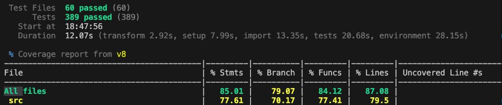

# Appendix: Frontend Test Coverage (前端測試覆蓋率)

本附錄記錄了前端 React SPA (`cets-web`) 的 Vitest 測試覆蓋率報告。測試採用 `v8` 作為覆蓋率收集工具。

## 測試執行結果

- **測試檔案 (Test Files)**: 60 passed (共 60 個檔案)
- **測試案例 (Tests)**: 389 passed (共 389 個案例)
- **執行時間 (Duration)**: 12.07 秒
- **覆蓋率工具 (Coverage tool)**: v8

## 覆蓋率數據摘要

| 範圍 (Scope) | 敘述覆蓋率 (% Stmts) | 分支覆蓋率 (% Branch) | 函式覆蓋率 (% Funcs) | 行覆蓋率 (% Lines) |
|---|---|---|---|---|
| **所有檔案 (All files)** | **85.01%** | **79.07%** | **84.12%** | **87.08%** |
| **原始碼目錄 (src)** | 77.61% | 70.17% | 77.41% | 79.50% |

## 終端機截圖

