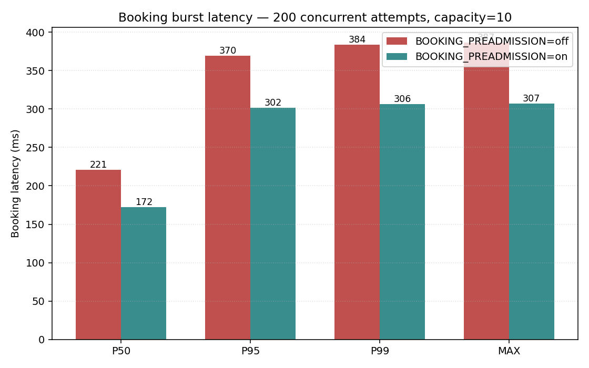
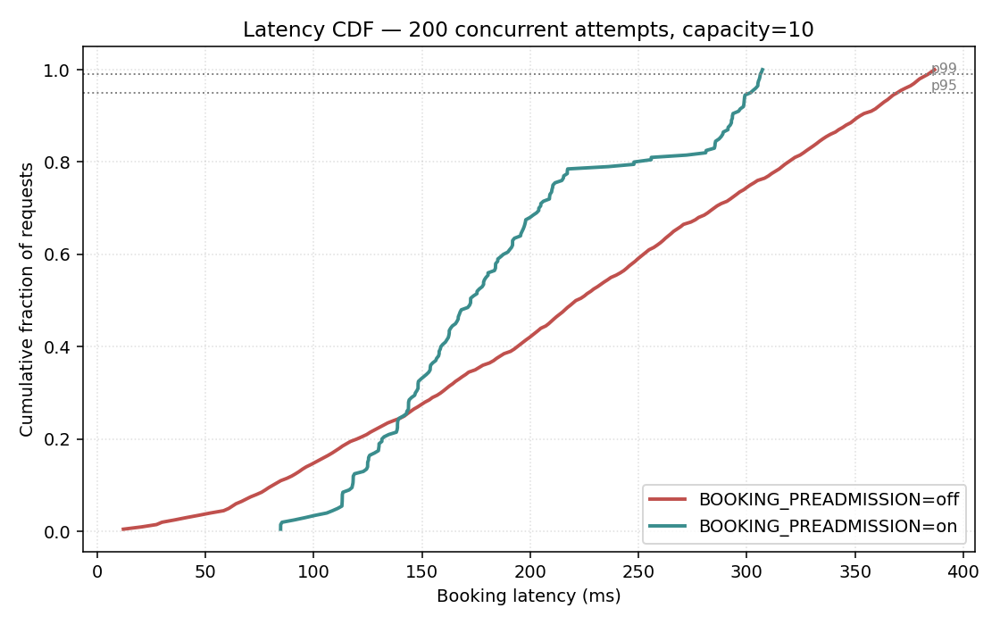
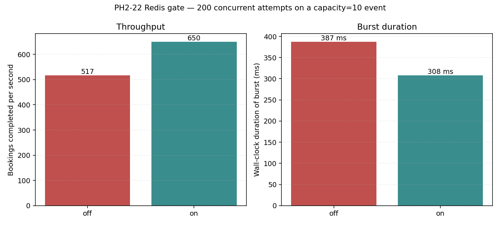
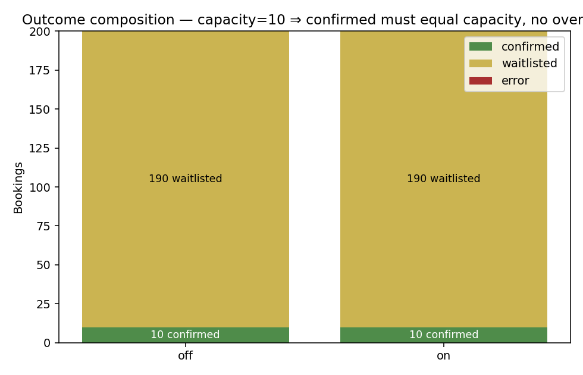

# PH2-22 Redis Reservation Gate — Experiment Report

> Linear: [COR-62](https://linear.app/tsmc-ticket-system/issue/COR-62/ph2-22-redis-lua-pre-admission-reservation).
> Spec: [`docs/specs/phase2-redis-reservation-gate.md`](../specs/phase2-redis-reservation-gate.md).
> Implementation PR: [#50](https://github.com/gilbert12tw/Event-Ticket-System/pull/50).
> Harness: [`scripts/run_reservation_experiment.sh`](../../scripts/run_reservation_experiment.sh) → [`services/api/cmd/reservation_experiment`](../../services/api/cmd/reservation_experiment).

## 1. Question

> When a hot, capacity-bound event receives many simultaneous booking attempts, does the PH2-22 Redis pre-admission gate measurably reduce booking latency and increase throughput, without ever overselling?

Phase 1 ships a DB-only booking path: every concurrent request takes `SELECT … FOR UPDATE` on the event row, then `SELECT count(*)` of confirmed registrations, then INSERTs. The hot exclusive row-lock serializes the workload. PH2-22 adds an atomic Redis pre-admission counter; when Redis reports `exhausted` the booking still produces a waitlist row, but the exclusive event-row lock and the confirmed-count query are both skipped. The question is whether the saved work is observable end-to-end.

## 2. Setup

| Component | Value |
| --- | --- |
| Host | macOS (Darwin 25.4.0), local Docker Desktop |
| Postgres | `postgres:16` via `services/api/deploy/compose.yaml`, default tuning |
| Redis | `redis:7.4.8-alpine`, default tuning |
| Workload | 200 concurrent goroutines, single limited event, `capacity = 10` |
| Booking path | `ticketing.Service.Book()` invoked in-process (no HTTP overhead) |
| Idempotency | Each goroutine uses a unique `(employee_id, idempotency_key)` tuple |
| Warm-up | One throwaway booking + Redis key flush before the timed burst |
| Metric source | Per-call wall-clock latency around `Service.Book()`; final DB count for correctness check |
| Modes compared | `BOOKING_PREADMISSION=off` (Phase 1 baseline) vs `=on` (PH2-22) |
| Reproduce | `EXPERIMENT_VUS=200 EXPERIMENT_CAPACITY=10 scripts/run_reservation_experiment.sh` |
| Safety guard | The runner sets `EXPERIMENT_ALLOW_DESTRUCTIVE=1` only for its Compose database; direct binary runs must set it explicitly because the harness truncates app tables and deletes reservation keys. |

Raw JSON summaries are committed at [`docs/reports/data/`](data/).

### Why in-process and not k6/HTTP?

The HTTP layer (router, auth middleware, JSON marshal/unmarshal, pgx connection pool wait) adds noise that would obscure the gate's effect. Calling `Service.Book()` directly isolates the booking critical section so the figures reflect what the gate actually does. The PH2-27 regression suite will exercise the full HTTP stack separately.

## 3. Results

### 3.1 Latency



| Percentile | gate off (ms) | gate on (ms) | Δ |
| --- | ---: | ---: | ---: |
| p50  | 221.1 | 172.5 | **−22.0 %** |
| p95  | 369.5 | 301.7 | **−18.3 %** |
| p99  | 383.7 | 306.3 | **−20.2 %** |
| max  | 386.7 | 307.3 | **−20.6 %** |
| mean | 220.0 | 186.9 | **−15.0 %** |

The CDF makes the shift even clearer — the gate-on curve sits to the left of gate-off across the full distribution, not just at the tail:



### 3.2 Throughput and burst duration



| Metric | gate off | gate on | Δ |
| --- | ---: | ---: | ---: |
| Wall-clock duration | 387 ms | 308 ms | **−20.5 %** |
| Effective RPS       | 517    | 650    | **+25.8 %** |

### 3.3 Correctness

The critical invariant is that PostgreSQL always finalizes exactly `capacity` confirmed bookings — Redis is advisory, not authority.



| Outcome      | gate off | gate on |
| ---          | ---:     | ---:    |
| Confirmed    | 10       | 10      |
| Waitlisted   | 190      | 190     |
| Error        | 0        | 0       |
| `count(*) FROM registrations WHERE status='confirmed'` (DB truth) | 10 | 10 |

Both modes preserve the oversell invariant exactly. PH2-22 does not change committed outcomes; it changes the *path* by which the same final state is reached.

## 4. Why the gate helps

In gate-off mode, every booking attempt acquires `SELECT … FOR UPDATE` on the event row, so the workload is fully serialized on a single exclusive row lock. Each thread holds the lock long enough to run `confirmedCountTx` (a `SELECT count(*)` over `registrations`), evaluate capacity, and INSERT. With 200 contenders, the lock-wait queue is the dominant cost.

In gate-on mode the booking service queries Redis first. Reservations are decremented atomically by the Lua script (one round-trip per request, parallel-safe). The first 10 requests get `granted` and take the same heavy path as before. The remaining 190 get `exhausted`, and `Service.Book()` then takes a fast path that:

1. Reads the event row without the exclusive `FOR UPDATE` lock (waitlist inserts have no capacity constraint; the implementation keeps a shared lock so event close/cancel/archive updates cannot race the final state recheck).
2. Skips `SELECT count(*) FROM registrations` entirely (status is already known to be `waitlisted`).
3. INSERTs the waitlist registration and commits.

That removes 190 exclusive row-lock acquisitions and 190 count queries from the contended critical section. The remaining throughput gain comes from those threads no longer serializing behind one another after the confirmed-path transactions drain.

## 5. Caveats

- **Single host, no network**: this is a local Compose run, so it removes network jitter between API → DB and API → Redis. Production Redis adds 0.5–2 ms RTT per call; that overhead lands in the granted-path latency but is offset by the much larger lock-wait savings on the exhausted path.
- **Cold caches**: each run truncates the DB and creates a fresh event, so Postgres planner caches and Redis Lua scripts are warm only for the timed phase (one warm-up call is done first). A long-running production instance would have an even smaller variance.
- **No service split**: this confirms the gate works inside the modular monolith. Phase 2 explicitly leaves Registration co-located with the rest of `ticketing`; the experiment does not argue for service extraction.
- **200 VUs / 10 capacity**: a worst-case-shaped burst. With less contention (e.g. capacity = 100, VUs = 100), the gate's benefit shrinks because the heavy path is no longer the bottleneck. The gate is a hot-event optimization, not a free win — its biggest impact is exactly when the system is under stress.

## 6. How to reproduce

```bash
# From the repo root, with Docker Desktop running:
EXPERIMENT_VUS=200 EXPERIMENT_CAPACITY=10 scripts/run_reservation_experiment.sh

# Different shape (heavier burst, larger event):
EXPERIMENT_VUS=400 EXPERIMENT_CAPACITY=25 scripts/run_reservation_experiment.sh

# Just plot from existing data:
scripts/.venv/bin/python scripts/plot_reservation_experiment.py \
  --off docs/reports/data/reservation_experiment_off.json \
  --on  docs/reports/data/reservation_experiment_on.json \
  --out docs/reports/figures
```

The script brings up Postgres + Redis, builds `cmd/reservation_experiment`, runs each mode against a freshly truncated schema, installs the plotter dependencies from `scripts/requirements-reservation-experiment.txt` into `scripts/.venv`, and generates the four PNGs above.

## 7. Conclusion

For the contended hot-event workload that PH2-WS3 is designed to handle, enabling `BOOKING_PREADMISSION=on` measurably reduces booking latency at every percentile (≈20 %) and increases sustained throughput (≈26 %), while PostgreSQL continues to be the only source of truth for confirmed bookings. The gate is safe to ship behind the existing env flag (off by default) and worth turning on for events expected to receive bursty traffic.
