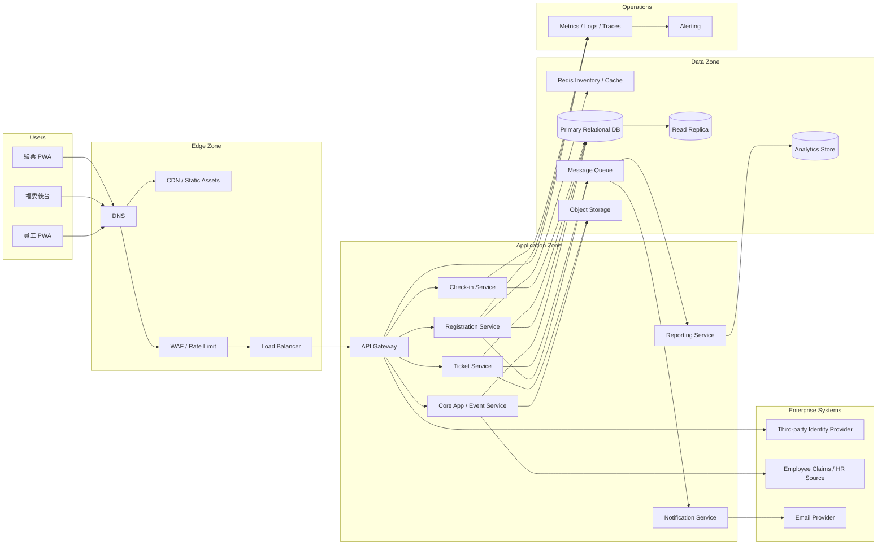
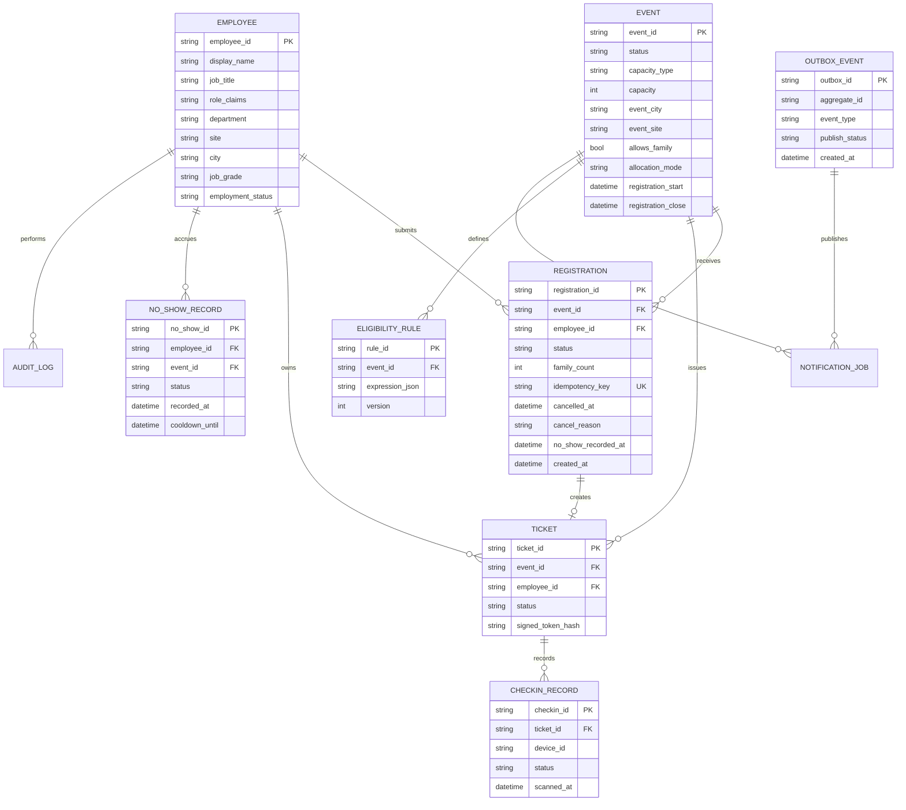
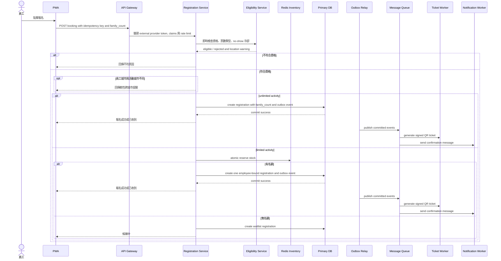
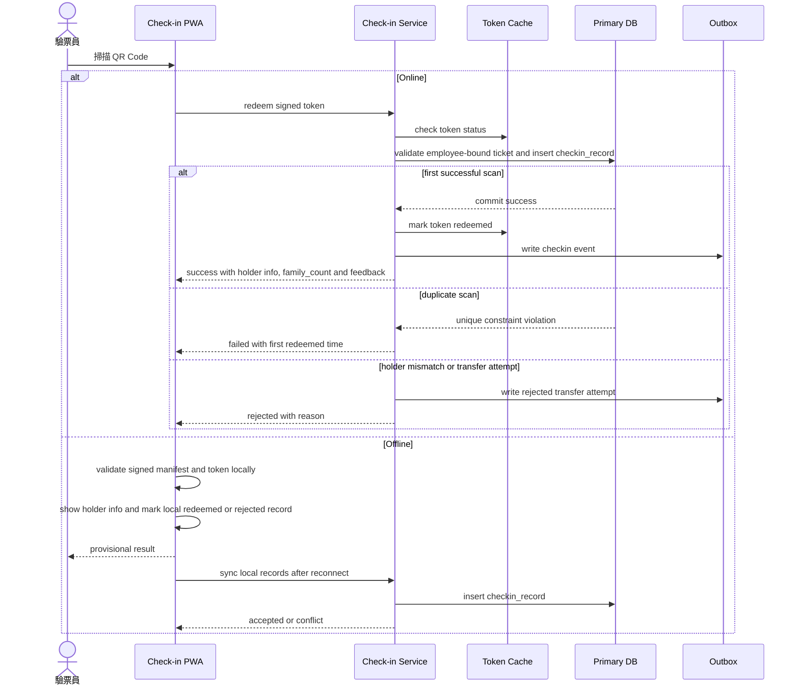

# 企業員工活動票務與現場驗票系統架構設計

## 1. Project Context & Assumptions

本文件以「企業員工活動票務與現場驗票系統」作為期末專案題目。系統服務對象是大型企業內部員工與福委會，目標是讓福委能發布公司活動、設定員工資格、處理報名配票、產生電子票券，並在活動現場完成快速且不重複的 QR Code 驗票。此系統不處理外部金流，也不實作登入服務；重點風險在於 limited 熱門活動開放瞬間的防超賣、員工資格正確性、跨城市提醒、票券不可轉讓、現場驗票可用性與稽核可追蹤性。

### 1.1 Persona

| Persona | 角色 | 主要目標 | 關注風險 |
| --- | --- | --- | --- |
| P-A | 員工 | 瀏覽活動、確認資格、報名、查看電子票券、現場入場 | 報名結果不明確、票券載入太慢、無網路時無法入場 |
| P-B | 福委 / 活動主辦 | 建立活動、設定資格、管理報名、發送通知、匯出報表 | 資格誤設、熱門活動超賣、通知誤發、報表不可信 |
| P-C | 驗票員 | 在現場快速掃描票券並核銷 | 網路不穩、重複掃描、多人多入口驗票衝突 |
| P-D | 系統管理員 / HR 報表使用者 | 管理權限映射、檢視員工參與報表、查詢 audit log | 權限過大、外部員工資料 claims 不完整、敏感操作無紀錄 |

### 1.2 Core User Journeys

| Journey | 說明 | 主要需求 |
| --- | --- | --- |
| J1 活動建立與資格設定 | 福委建立活動、設定名額、報名期間、資格條件與通知模板 | FR-EVENT、FR-QUAL、FR-NOTI |
| J2 員工報名與配票 | 員工進入詳情頁，系統檢查資格、票數規則、跨城市提醒與取消限制，依先搶先得或抽籤規則配票 | FR-REG、FR-TKT |
| J3 電子票券與現場驗票 | 員工出示 QR Code，驗票員線上或離線核銷票券 | FR-TKT、FR-CHK |
| J4 報表與稽核 | 活動後統計報名、出席、部門分佈，並保留敏感操作紀錄 | FR-REPORT、FR-ADMIN |

### 1.3 Assumptions

| 類別 | 假設 |
| --- | --- |
| 公司規模 | 最終高流量階段以 90,000 名員工設計，早期先服務 10,000 名員工。 |
| 使用端 | 不做原生 mobile app，採 Responsive Web + PWA，支援離線票券顯示與離線驗票。 |
| 身分整合 | 登入、登出與帳號生命週期由外部第三方 identity provider 處理；本系統只驗證 token、讀取員工 claims，且不實作密碼、登入頁或登入狀態生命週期。 |
| 員工資料 | 外部 provider / HR 來源提供員工姓名、職稱 / 職缺、角色、部門、廠區與城市等 claims；本系統只保存票務所需的快取與稽核參照。 |
| 雲端平台 | 採 cloud-agnostic 設計，可對應 AWS、GCP、Azure 或私有雲等價能力。 |
| 資料庫預設 | 以 relational database 作為 source of truth，因票券、報名、資格與 audit log 需要明確交易邊界。 |
| 活動型態 | 活動票券通常免費或內部福利點數扣抵；本版本不納入外部付款流程。活動分為有限票數與無票數限制兩類，兩者的家屬、取消與防超賣規則不同。 |
| Phase 邊界 | Phase 1 重視快速交付與可維護，採 Go modular monolith 與外部 provider claims 邊界；Phase 2 針對熱門活動拆分高壓模組；Phase 3 強化多入口驗票、資料分區與跨區容災。 |

### 1.4 Phase 1 Contract Clarifications

`docs/specs/phase1-mvp.md`、`docs/specs/phase1-production-upper-bound.md` 與 `docs/openapi.yaml` 是 Phase 1 執行契約。為避免把長期目標誤認為 Phase 1 必做項，Phase 1 採以下邊界：

- 產品不提供本地登入、登出、密碼、session 或 refresh token rotation；本系統只驗證外部 provider token 並消費 employee claims。Local/demo auth 僅可作為非正式環境相容工具，不可出現在產品 OpenAPI contract。
- `FR-EVENT-04` 的活動圖片 / 附件上傳、掃毒與 serving 是後續規格項；Phase 1 可保留文字、地點與連結資訊，但不交付檔案上傳流程。
- `FR-REPORT-02` 的 Excel / PDF 匯出是後續規格項；Phase 1 僅交付 HR 授權的 aggregate CSV 匯出與報表欄位白名單。
- `NFR-HA-01` 至 `NFR-HA-04` 是 production / later-phase 目標；Phase 1 不承諾跨 AZ、RTO / RPO 或 managed-cloud HA，只需保留 12-Factor、健康檢查、stateless process、Docker Compose parity 與未來部署演進空間。

## 2. Functional Requirements

需求依模組分類，每條需求使用唯一 ID，後續架構設計、測試與稽核可用這些 ID 追蹤。

### 2.1 身分資料與授權

| ID | 需求描述 | 對應 Persona |
| --- | --- | --- |
| FR-AUTH-01 | 登入、登出、密碼與登入狀態生命週期由外部 identity provider 處理；本系統只接受並驗證 provider 發出的 token。 | P-A、P-B、P-C、P-D |
| FR-AUTH-02 | 系統需從 provider claims 讀取 employee_id、姓名、職稱 / 職缺、角色、部門、廠區與城市，作為資格、地點提醒、報表與稽核的輸入。 | All |
| FR-AUTH-03 | 後台採 RBAC，將 provider role claims 映射為系統管理員、活動主辦、驗票員與 HR / reporting 使用者。 | P-B、P-C、P-D |
| FR-AUTH-04 | 必要 claims 缺失或角色無法映射時，系統應拒絕敏感操作，並回傳可理解的錯誤或降級為只讀瀏覽。 | All |
| FR-AUTH-05 | 敏感操作包含活動異動、資格異動、管理員例外取消、撤銷票券、報表匯出，皆需寫入 immutable audit log。 | P-B、P-D |

### 2.2 活動管理

| ID | 需求描述 |
| --- | --- |
| FR-EVENT-01 | 福委可建立活動，欄位包含名稱、描述、日期時間、活動地點、活動城市 / 廠區、票數類型、總票數、報名期間、入場方式。 |
| FR-EVENT-02 | 支援活動編輯、下架、複製、刪除；變更需記錄版本與操作者。 |
| FR-EVENT-03 | 支援活動分類與標籤，例如藝文、講座、家庭日、員工旅遊。 |
| FR-EVENT-04 | 支援活動主視覺圖片與附件上傳，並限制檔案大小、型別與掃毒流程。 |
| FR-EVENT-05 | 活動狀態機為草稿、待審核、開放報名、報名截止、活動進行中、已結束、封存。 |
| FR-EVENT-06 | 活動列表與詳情頁依使用者資格與活動狀態顯示可報名、不可報名或候補資訊。 |
| FR-EVENT-07 | 票數類型分為 limited 與 unlimited；limited 必須設定 capacity，unlimited 不扣庫存且可允許填寫家屬人數。 |
| FR-EVENT-08 | limited 活動不可攜帶家屬，且同一員工同一活動最多只能取得一張票；unlimited 活動以員工主報名加 family_count 記錄同行家屬。 |

### 2.3 資格規則設定

| ID | 需求描述 |
| --- | --- |
| FR-QUAL-01 | 支援依外部 provider / HR claims 設定廠區、城市、部門、職等範圍、到職年資、職務類別、自訂標籤等多維度資格條件。 |
| FR-QUAL-02 | 條件可組合 AND / OR / NOT，也支援全員開放。 |
| FR-QUAL-03 | 員工點擊申請時，系統需即時驗證資格、票數類型、no-show 冷卻狀態並回傳不符原因。 |
| FR-QUAL-04 | 活動進行中可修改資格條件，所有變更寫入 audit log，並對新符合資格者補發通知。 |
| FR-QUAL-05 | 後台設定條件導致符合員工數為 0 時，即時顯示警示。 |
| FR-QUAL-06 | 外部 provider / HR claims 異動時，系統需標記受影響報名或票券為待審核並通知管理員。 |

### 2.4 報名與配票

| ID | 需求描述 |
| --- | --- |
| FR-REG-01 | 支援先搶先得與抽籤兩種配票模式。 |
| FR-REG-02 | 詳情頁需依票數類型顯示剩餘票數、總票數、是否可帶家屬、報名截止倒數與跨城市提醒。 |
| FR-REG-03 | limited 活動配票機制需防超賣，且同一員工同一活動最多只能成功報名一張票。 |
| FR-REG-04 | unlimited 活動不扣庫存，可讓員工填寫 family_count 記錄同行家屬人數，但主報名與票券仍綁定員工本人。 |
| FR-REG-05 | limited 活動支援候補機制，取消或逾期未確認時可自動遞補；unlimited 活動不需要候補。 |
| FR-REG-06 | 抽籤支援預定時間自動執行，且結果可重現。 |
| FR-REG-07 | 員工送出申請後立即顯示狀態，包含已收到、已抽中、未抽中、候補中。 |
| FR-REG-08 | 員工只能在報名期間自行取消；報名截止後不可自行取消，除非活動主辦或系統管理員執行例外取消並留下原因與 audit log。 |
| FR-REG-09 | 若員工城市與活動城市不同，例如員工在新竹但活動在台南，詳情頁與報名前確認需顯示軟性警告，但不得阻擋符合資格者報名。 |
| FR-REG-10 | 截止後未到場者需累積 no-show 紀錄；達到系統參數門檻後，員工進入有限票活動報名冷卻期，無票數限制活動可不受此限制。 |

### 2.5 電子票券

| ID | 需求描述 |
| --- | --- |
| FR-TKT-01 | 員工取得票券後，系統自動產生帶 QR Code 的電子票券。 |
| FR-TKT-02 | 我的票券頁面為單一入口，導航深度不超過兩層。 |
| FR-TKT-03 | 票券狀態包含未使用、已核銷、已取消、已過期，且需視覺區隔。 |
| FR-TKT-04 | limited 活動同一員工同一活動只能持有一張有效票；unlimited 活動以員工主票加 family_count 顯示同行人數，不產生可轉讓家屬票。 |
| FR-TKT-05 | 票券支援離線顯示，無網路仍可呈現 QR Code。 |
| FR-TKT-06 | QR Code 需包含 signed token 或短期 token，避免偽造與截圖轉售。 |
| FR-TKT-07 | 票券嚴禁轉讓，需綁定 employee_id；QR token 只代表該員工的入場權，不可作為轉讓憑證。 |

### 2.6 驗票與核銷

| ID | 需求描述 |
| --- | --- |
| FR-CHK-01 | 驗票員進入驗票模式後，頁面可啟動裝置鏡頭並開始辨識 QR Code。 |
| FR-CHK-02 | 掃描 QR Code 後需於 P99 200ms 內回傳驗票結果。 |
| FR-CHK-03 | 驗票結果需有明確視覺與聲音回饋。 |
| FR-CHK-04 | 同一張票第二次掃描必須失敗，並顯示首次核銷時間。 |
| FR-CHK-05 | 驗票畫面需顯示活動名稱、票券持有人姓名 / 部門 / 城市與已入場 / 總名額即時數字，讓驗票員可辨識代用或轉讓風險。 |
| FR-CHK-06 | 支援離線驗票，預先下載有效票券清單至本機，網路恢復後同步並偵測衝突。 |
| FR-CHK-07 | 支援多裝置同時驗票，以服務同活動多入口現場。 |
| FR-CHK-08 | 若驗票員發現票券轉讓、代用或持有人不符，應能拒絕入場並記錄原因、staff_id、device_id 與時間。 |

### 2.7 通知

| ID | 需求描述 |
| --- | --- |
| FR-NOTI-01 | 通知管道至少包含 Email 與站內訊息，行動推播列為未來擴充。 |
| FR-NOTI-02 | 員工可選擇通知管道並拒絕特定類型活動通知。 |
| FR-NOTI-03 | 觸發事件包含活動開放、報名確認、抽籤結果、活動提醒、跨城市提醒、資格異動、取消結果、no-show 冷卻狀態、票券狀態變更。 |
| FR-NOTI-04 | 通知不得在活動條件未確認前發出，避免誤通知不符資格者。 |
| FR-NOTI-05 | 通知內容需包含活動名稱、時間地點、截止時間、票券不可轉讓提醒與直達連結；跨城市活動需明確標示活動城市。 |

### 2.8 報表與分析

| ID | 需求描述 |
| --- | --- |
| FR-REPORT-01 | 提供活動即時 dashboard，包含報名數、同行家屬人數、出席數、部門分佈、城市分佈、到場率。 |
| FR-REPORT-02 | 活動結束後可匯出 CSV、Excel、PDF。 |
| FR-REPORT-03 | 提供跨活動歷史統計，例如年度活動數、平均到場率、熱門活動類型。 |

### 2.9 系統與整合

| ID | 需求描述 |
| --- | --- |
| FR-ADMIN-01 | 與外部 identity provider / HR 來源整合，定期更新員工 claims 快取與在職狀態，但不實作登入或帳號生命週期。 |
| FR-ADMIN-02 | 提供系統參數設定，如票券保留時間、抽籤排程、通知模板、no-show 冷卻門檻與冷卻期間。 |
| FR-ADMIN-03 | 提供 audit log 查詢介面，支援依時間、操作者、操作類型過濾。 |
| FR-ADMIN-04 | 提供內部 API，讓未來企業內部系統串接活動資訊。 |

## 3. Non-Functional Requirements

### 3.1 Availability and Fault Tolerance

| ID | Requirement | 架構含意 |
| --- | --- | --- |
| NFR-HA-01 | 一般使用端 uptime SLO ≥ 99.9%。 | Web/API 至少跨兩個 Availability Zone，負載平衡與健康檢查自動移除異常節點。 |
| NFR-HA-02 | 驗票與核銷端點 uptime SLO ≥ 99.95%。 | Check-in Service 可獨立擴容，且支援離線驗票降級。 |
| NFR-HA-03 | RTO ≤ 30 分鐘，RPO ≤ 5 分鐘。 | 資料庫定期備份、point-in-time recovery、跨 AZ replica。 |
| NFR-HA-04 | 非核心功能失效不得拖垮核心報名與驗票。 | 通知、報表、票券 PDF 生成改為 queue-based 非同步處理，並使用 circuit breaker。 |

### 3.2 Scalability

| ID | Requirement | 架構含意 |
| --- | --- | --- |
| NFR-SCALE-01 | Phase 3 支援 90,000 員工規模，熱門活動約 54,000 人活躍。 | API 與無狀態服務可 horizontal scale-out。 |
| NFR-SCALE-02 | Phase 3 設計尖峰約 1,000 App RPS、120 Booking TPS、10,000 concurrent users。 | 熱門讀取使用 CDN / cache / read replica；limited 活動核心訂票使用 Redis 原子扣減與 DB 最終確認，unlimited 活動不走庫存扣減。 |
| NFR-SCALE-03 | 報名開放瞬間可吸收額外重試與刷新流量。 | Rate limiting、idempotency key、queue backlog 監控與 autoscaling。 |
| NFR-SCALE-04 | Reporting 查詢不得影響 OLTP 訂票交易。 | Phase 2 起採 CQRS，報表走 read replica 或 analytics store。 |

### 3.3 Performance

| Operation | P99 Latency Target | 說明 |
| --- | --- | --- |
| 活動列表瀏覽 | < 200ms | 以 cache、CDN 靜態資源與 read replica 支援。 |
| 資格查詢 | < 300ms | Provider / HR claims 快取可加速，但訂票前需重新 double-check 必要 claims、資格與冷卻狀態。 |
| 報名請求 | < 500ms | 同步路徑只完成授權、資格、票數類型、名額保留或 family_count 與報名狀態寫入；通知與票券生成非同步。 |
| 現場核銷 | < 200ms | 線上核銷走 Ticket/Check-in Service 與短 TTL cache；離線時走本機清單。 |
| 票券生成 | < 2s | QR Code 與 PDF 可非同步生成，不阻塞報名確認。 |

### 3.4 Security and Privacy

| ID | Requirement | 架構含意 |
| --- | --- | --- |
| NFR-SEC-01 | 全站 TLS 1.2+，內部服務間使用 mTLS 或私有網路 ACL。 | Edge LB 終止 TLS，服務間權限最小化。 |
| NFR-SEC-02 | 使用外部 identity provider token 與 RBAC，不保存密碼、不實作登入或登入狀態生命週期。 | Auth 模組只驗證 token、必要 claims 與權限，不處理 password lifecycle。 |
| NFR-SEC-03 | PII 在 log 中 mask，報表匯出需權限控管與 audit log。 | 結構化 log 不保存完整員工資料。 |
| NFR-SEC-04 | QR Code 使用 signed token，並以 token hash 驗證與核銷，且 token 必須綁定 employee_id。 | 外洩 QR Code 無法被修改；核銷後 token 立即失效；代用或轉讓可被拒絕並記錄。 |
| NFR-SEC-05 | 報名 API 具備 rate limiting、CSRF 防護、輸入驗證與 idempotency key。 | 防止重放、暴力刷新與重複扣票。 |

### 3.5 Observability

| 類別 | 指標 / 紀錄 |
| --- | --- |
| Metrics | RPS、P50/P95/P99 latency、error rate、queue lag、DB CPU、DB lock wait、cache hit rate、剩餘票數、跨城市提醒次數、no-show 冷卻命中、核銷成功率。 |
| Logs | JSON structured logs，包含 trace_id、masked user_id、event_id、action、status，不記錄完整 PII。 |
| Traces | 報名、抽籤、票券生成、通知、核銷、離線同步等 critical flow 使用 OpenTelemetry tracing。 |
| Alerts | Error rate > 1%、P99 超標 5 分鐘、queue lag 超過 3 分鐘、DB lock wait 異常、票數為 0 仍有成功扣票事件。 |

### 3.6 Consistency, Maintainability, Deployability

| ID | Requirement | 架構含意 |
| --- | --- | --- |
| NFR-CONS-01 | limited 活動報名與票券不可超賣，DB 為最終 source of truth。 | Redis 只做 reservation gate，DB transaction 才是確認結果；unlimited 活動不扣庫存。 |
| NFR-CONS-02 | DB 寫入與事件發布不可出現 dual-write 不一致。 | 使用 transactional outbox，同一 transaction 寫入 business data 與 outbox event。 |
| NFR-CONS-03 | 離線驗票恢復連線後需偵測重複核銷。 | Check-in record 對 ticket_id 建 unique constraint，first commit wins。 |
| NFR-MAINT-01 | 新增配票模式不可大量修改既有流程。 | Application Architecture 使用 AllocationStrategy 介面。 |
| NFR-DEPLOY-01 | 支援 blue-green 或 rolling deployment，部署失敗可 rollback。 | Stateless service、DB migration backward compatible、feature flag 控制新流程。 |
| NFR-TEST-01 | 關鍵 domain rule 與資料一致性流程需具備自動化測試。 | 單元測試涵蓋資格、票數類型、家屬人數、取消期限、no-show 冷卻、票券不可轉讓；整合測試涵蓋 outbox 與重試。 |

### 3.7 Requirement Verification Scenarios

| Scenario | 驗證重點 |
| --- | --- |
| limited 活動報名 | 同一員工重複報名只會得到一張票；高併發下不超賣；家屬人數欄位不可用。 |
| unlimited 活動報名 | 員工可報名並填 family_count；流程不扣庫存、不建立候補；報表可統計員工與同行家屬總人數。 |
| 外部 provider claims | 缺少 employee_id、角色、部門、城市等必要 claims 時拒絕敏感操作或降級；role claims 正確映射到員工、主辦、驗票員、HR / reporting。 |
| 跨城市提醒 | 員工城市與活動城市不同時顯示明確軟性警告，但符合資格者仍可繼續報名。 |
| 取消與 no-show | 報名期間可自行取消；截止後員工不可自行取消；未出席累積 NoShowRecord 並觸發 limited 活動冷卻限制。 |
| 票券不可轉讓 | QR token 重放、他人代用、重複核銷或持有人不符都會失敗或被標示為風險事件，並留下 audit / check-in record。 |

## 4. Estimate Usage

### 4.1 Estimation Model

本系統的日常流量偏低，但熱門福利活動開放時會出現集中流量。估算採以下模型：

| 參數 | 假設 |
| --- | --- |
| 有效日常使用時間 | 8 小時，等於 28,800 秒。 |
| 平均 RPS | `DAU × 每人每日操作次數 / 28,800`。 |
| 熱門活動報名窗口 | 1 小時。 |
| 80/20 集中模型 | 80% 熱門活動流量集中在前 20% 時間，即前 12 分鐘，共 720 秒。 |
| 每位熱門活動使用者動態請求 | 平均 8 次，包含列表、詳情、資格、剩餘名額、送出、結果、票券、重試。 |
| 每位熱門活動使用者核心交易 | 最多 1 次 booking transaction。 |
| Concurrent users | `熱門活動使用者 × 0.8 × 0.2`。 |
| Safety factor | 設計容量乘上 2 倍，吸收重試、估算誤差與突發流量。 |

### 4.2 Three-Phase Usage Estimate

| Phase | 員工規模 | 一般日 DAU / 行為 | 一般 Avg RPS | 熱門活動活躍 | 資料量估算 |
| --- | --- | --- | --- | --- | --- |
| Phase 1 初期 | 10,000 | DAU 500，每人 3 次操作 | `500×3/28800 = 0.052` | 2,000 人參與部門級或小型公司活動 | DB 5-10 GB/year；logs/audit 100 GB/year；object storage 50 GB/year |
| Phase 2 成長期 | 50,000 | DAU 5,000，每人 5 次操作 | `5000×5/28800 = 0.87` | 15,000 人參與大型福利活動 | DB 50-100 GB/year；logs/audit 1 TB/year；object storage 300 GB/year |
| Phase 3 高流量 | 90,000 | DAU 18,000，每人 6 次操作 | `18000×6/28800 = 3.75` | 54,000 人參與全公司熱門活動 | DB 300-500 GB/year；logs/audit 3-6 TB/year；object storage 1 TB+/year |

日常平均 RPS 看似很低，但真正的容量瓶頸是熱門活動的前 12 分鐘。這也是 Phase 2 開始將報名、通知、報表拆分的原因：平均值不足以代表搶票瞬間的 lock contention、重試流量與外部通知延遲。

### 4.3 Peak RPS / TPS / Concurrency

| Phase | Hot Active Users | Raw App RPS | Design App RPS | Raw Booking TPS | Design Booking TPS | Concurrent Target |
| --- | ---: | ---: | ---: | ---: | ---: | ---: |
| Phase 1 | 2,000 | `2000×8×0.8/720 = 17.8` | 36 RPS | `2000×1×0.8/720 = 2.2` | 5 TPS | 320 |
| Phase 2 | 15,000 | `15000×8×0.8/720 = 133.3` | 270 RPS | `15000×1×0.8/720 = 16.7` | 35 TPS | 2,400 |
| Phase 3 | 54,000 | `54000×8×0.8/720 = 480` | 960-1,000 RPS | `54000×1×0.8/720 = 60` | 120 TPS | 10,000 |

### 4.4 Read / Write Ratio and Bottlenecks

| 情境 | Read / Write Ratio | 主要瓶頸 | 架構回應 |
| --- | --- | --- | --- |
| 日常瀏覽 | 約 95:5 | 活動列表與圖片載入 | CDN、cache、read replica。 |
| 熱門報名前 12 分鐘 | 約 80:20，但 limited 活動 writes 集中在同一活動名額 | 庫存扣減、DB row lock、重試風暴 | Redis atomic reservation、idempotency key、rate limiting、DB transaction confirm；unlimited 活動跳過庫存扣減。 |
| 抽籤執行 | 約 30:70 | 批次排序、結果寫入、通知事件 | Background worker、deterministic seed、outbox。 |
| 現場驗票 | 約 40:60 | 單票 exactly-once 核銷、多裝置同步 | unique constraint、short TTL token cache、offline sync conflict detection。 |
| 報表分析 | 約 99:1 | 大範圍掃描與聚合 | CQRS、read replica、analytics store。 |

### 4.5 Cloud Service Cost Estimate

成本估算使用 AWS Asia Pacific (Taipei) Region，Region code 為 `ap-east-2`。單價由 `estimate_aws_cost.py` 透過 AWS Price List Bulk API 自動抓取，並以 On-Demand、每月 730 小時計算。以下金額皆為 USD，不含 Free Tier、Savings Plans、Reserved Instances、稅金、企業支援方案與未列出的資料傳輸費。Kubernetes 成本採 recommended policy：Phase 1 不啟用 EKS，Phase 2 與 Phase 3 各配置 1 個 Amazon EKS Standard Cluster，因為服務拆分後才需要較完整的 deployment、autoscaling 與 service governance。

| Phase | 部署策略 | Estimated Monthly Cost |
| --- | --- | ---: |
| Phase 1 初期 | Modular monolith + managed compute，不使用 EKS | USD 289.98 |
| Phase 2 成長期 | 拆出 hot path services，使用 1 個 EKS cluster | USD 1,677.49 |
| Phase 3 高流量 | 多服務獨立擴縮，使用 1 個 EKS cluster | USD 5,662.06 |

Phase 1 成本明細如下：

| Service | Usage | API Unit Price | Monthly Cost |
| --- | --- | ---: | ---: |
| EC2 Linux On-Demand | `t4g.small × 2 × 730 hrs` | USD 0.0194/hr | USD 28.32 |
| RDS PostgreSQL Multi-AZ | `db.t4g.medium × 1 × 730 hrs` | USD 0.182/hr | USD 132.86 |
| RDS PostgreSQL gp3 Storage | `Multi-AZ 50 GB-month` | USD 0.248/GB-month | USD 12.40 |
| ElastiCache Redis | `cache.t4g.micro × 1 × 730 hrs` | USD 0.0225/node-hour | USD 16.43 |
| Application Load Balancer | `1 ALB × 730 hrs` | USD 0.0219/hr | USD 15.99 |
| Application Load Balancer LCU | `730 LCU-hours` | USD 0.008/LCU-hour | USD 5.84 |
| NAT Gateway | `1 NAT × 730 hrs` | USD 0.0558/hr | USD 40.73 |
| NAT Gateway Data Processing | `20 GB` | USD 0.0558/GB | USD 1.12 |
| S3 Standard Storage | `50 GB-month` | USD 0.0225/GB-month | USD 1.13 |
| SQS Standard Requests | `1,000,000 requests` | USD 0.00000036/request | USD 0.36 |
| CloudWatch Logs Ingest | `10 GB` | USD 0.50/GB | USD 5.00 |
| CloudWatch Logs Storage | `20 GB-month` | USD 0.03/GB-month | USD 0.60 |
| CloudWatch Custom Metrics | `50 metric-months` | USD 0.30/metric-month | USD 15.00 |
| CloudWatch Standard Alarms | `10 alarm-months` | USD 0.10/alarm-month | USD 1.00 |
| CloudFront AP Data Out | `100 GB` | USD 0.12/GB | USD 12.00 |
| CloudFront HTTPS Requests | `1,000,000 requests` | USD 0.0000012/request | USD 1.20 |
| **Total** |  |  | **USD 289.98** |

Phase 2 成本明細如下：

| Service | Usage | API Unit Price | Monthly Cost |
| --- | --- | ---: | ---: |
| Amazon EKS Standard Cluster | `1 cluster × 730 hrs` | USD 0.10/cluster-hour | USD 73.00 |
| EC2 Linux On-Demand | `m7g.large × 6 × 730 hrs` | USD 0.0949/hr | USD 415.66 |
| RDS PostgreSQL Multi-AZ | `db.m7g.large × 1 × 730 hrs` | USD 0.422/hr | USD 308.06 |
| RDS PostgreSQL Read Replica | `db.m7g.large Single-AZ × 1 × 730 hrs` | USD 0.211/hr | USD 154.03 |
| RDS PostgreSQL gp3 Storage | `Multi-AZ 200 GB-month` | USD 0.248/GB-month | USD 49.60 |
| RDS Replica gp3 Storage | `Single-AZ 200 GB-month` | USD 0.124/GB-month | USD 24.80 |
| ElastiCache Redis | `cache.m7g.large × 2 × 730 hrs` | USD 0.1818/node-hour | USD 265.43 |
| Application Load Balancer | `2 ALB × 730 hrs` | USD 0.0219/hr | USD 31.97 |
| Application Load Balancer LCU | `2,920 LCU-hours` | USD 0.008/LCU-hour | USD 23.36 |
| NAT Gateway | `2 NAT × 730 hrs` | USD 0.0558/hr | USD 81.47 |
| NAT Gateway Data Processing | `200 GB` | USD 0.0558/GB | USD 11.16 |
| S3 Standard Storage | `300 GB-month` | USD 0.0225/GB-month | USD 6.75 |
| SQS Standard Requests | `20,000,000 requests` | USD 0.00000036/request | USD 7.20 |
| CloudWatch Logs Ingest | `100 GB` | USD 0.50/GB | USD 50.00 |
| CloudWatch Logs Storage | `300 GB-month` | USD 0.03/GB-month | USD 9.00 |
| CloudWatch Custom Metrics | `300 metric-months` | USD 0.30/metric-month | USD 90.00 |
| CloudWatch Standard Alarms | `40 alarm-months` | USD 0.10/alarm-month | USD 4.00 |
| CloudFront AP Data Out | `500 GB` | USD 0.12/GB | USD 60.00 |
| CloudFront HTTPS Requests | `10,000,000 requests` | USD 0.0000012/request | USD 12.00 |
| **Total** |  |  | **USD 1,677.49** |

Phase 3 成本明細如下：

| Service | Usage | API Unit Price | Monthly Cost |
| --- | --- | ---: | ---: |
| Amazon EKS Standard Cluster | `1 cluster × 730 hrs` | USD 0.10/cluster-hour | USD 73.00 |
| EC2 Linux On-Demand | `m7g.xlarge × 12 × 730 hrs` | USD 0.1897/hr | USD 1,661.77 |
| RDS PostgreSQL Multi-AZ | `db.m7g.2xlarge × 1 × 730 hrs` | USD 1.688/hr | USD 1,232.24 |
| RDS PostgreSQL Read Replicas | `db.m7g.xlarge Single-AZ × 2 × 730 hrs` | USD 0.422/hr | USD 616.12 |
| RDS PostgreSQL gp3 Storage | `Multi-AZ 500 GB-month` | USD 0.248/GB-month | USD 124.00 |
| RDS Replica gp3 Storage | `Single-AZ 1,000 GB-month` | USD 0.124/GB-month | USD 124.00 |
| ElastiCache Redis | `cache.r7g.large × 3 × 730 hrs` | USD 0.2367/node-hour | USD 518.37 |
| Application Load Balancer | `3 ALB × 730 hrs` | USD 0.0219/hr | USD 47.96 |
| Application Load Balancer LCU | `14,600 LCU-hours` | USD 0.008/LCU-hour | USD 116.80 |
| NAT Gateway | `3 NAT × 730 hrs` | USD 0.0558/hr | USD 122.20 |
| NAT Gateway Data Processing | `1,000 GB` | USD 0.0558/GB | USD 55.80 |
| S3 Standard Storage | `1,024 GB-month` | USD 0.0225/GB-month | USD 23.04 |
| SQS Standard Requests | `100,000,000 requests` | USD 0.00000036/request | USD 36.00 |
| CloudWatch Logs Ingest | `500 GB` | USD 0.50/GB | USD 250.00 |
| CloudWatch Logs Storage | `1,500 GB-month` | USD 0.03/GB-month | USD 45.00 |
| CloudWatch Custom Metrics | `1,000 metric-months` | USD 0.30/metric-month | USD 300.00 |
| CloudWatch Standard Alarms | `100 alarm-months` | USD 0.10/alarm-month | USD 10.00 |
| CloudFront AP Data Out | `2,048 GB` | USD 0.12/GB | USD 245.76 |
| CloudFront HTTPS Requests | `50,000,000 requests` | USD 0.0000012/request | USD 60.00 |
| **Total** |  |  | **USD 5,662.06** |

從成本角度看，Phase 1 不導入 EKS 可避免每月固定 USD 73 的 cluster control plane 費用，對初期 USD 289.98 的月費而言約增加 25%。Phase 2 與 Phase 3 因服務數量與獨立擴縮需求增加，EKS 成本占比分別約 4.4% 與 1.3%，此時其 deployment automation、HPA、rolling update 與服務治理價值較能抵銷固定成本。若需繳交台幣估算，可在最後依財務假設匯率換算；本文件保留 USD，避免把匯率波動誤認為雲服務單價變化。

## 5. System Architecture

### 5.1 Overall System Architecture

此圖說明系統的流量入口、服務分工、資料儲存與外部整合。Edge Zone 負責 TLS、WAF、rate limiting 與靜態資源快取；Application Zone 將高風險流程拆成報名、票券、驗票、通知與報表服務；Data Zone 則明確區分 source of truth、cache、queue、read replica 與 analytics store。登入與員工基本資料由外部 provider 提供，本系統只消費 token 與 claims。這個設計直接對應 NFR-HA、NFR-SCALE 與 NFR-CONS：可水平擴充的服務在前方吸收流量，但最後確認仍回到 relational DB 的交易邊界。

### 5.2 Phase 1 Architecture: Modular Monolith First

Phase 1 員工規模約 10,000，熱門活動設計尖峰約 36 RPS、5 TPS。此階段採 modular monolith，將 Event、Eligibility、Registration、Ticket、Notification、Reporting 寫在同一應用程式內，但以模組邊界與 repository interface 分離責任。部署上使用兩個以上 app instances、managed relational DB、object storage、Redis cache 與一個簡單 message queue，不導入 EKS，避免在初期用量很小時增加固定 control plane 成本與 Kubernetes 維運負擔。

此階段不直接切成大量 microservices，原因是流量尚未高到需要分散式治理，而過早拆分會增加部署、監控、跨服務一致性與除錯成本。Phase 1 的重點是先把 domain boundary、資料模型、狀態機、audit log 與測試做好，讓後續拆分有清楚依據。

### 5.3 Phase 2 Architecture: Split Hot Paths

Phase 2 員工規模約 50,000，熱門活動設計尖峰約 270 RPS、35 Booking TPS，開始出現 limited 活動名額被大量請求競爭的情境。此階段可導入 1 個 managed Kubernetes / EKS cluster，讓 Registration、Notification、Reporting 能以獨立 deployment、HPA 與 rolling update 管理。此階段拆出三個服務：

| Service | 拆分原因 | Tradeoff |
| --- | --- | --- |
| Registration Service | limited 活動報名與配票是尖峰寫入熱點，需要獨立 scale-out 並使用 Redis atomic reservation 降低 DB hot-row lock contention；unlimited 活動走無庫存報名流程。 | 引入 Redis 與補償流程，DB 仍需做最終確認；需明確分流 limited / unlimited 行為。 |
| Notification Service | Email 與站內通知依賴外部 I/O，若同步處理會阻塞報名請求。 | 通知變成 eventual consistency，需要 queue retry 與 dead-letter queue。 |
| Reporting Service | 報表聚合會掃描大量資料，可能污染 OLTP DB cache。 | 需要維護 read model 或 analytics store，資料可能有數分鐘延遲。 |

Phase 2 也是 CQRS 開始有價值的階段：報名、票券、核銷等一致性敏感寫入仍走 primary DB；活動列表、dashboard、歷史報表走 read replica 或 analytics store。這能讓讀取流量與交易寫入互不干擾。

### 5.4 Phase 3 Architecture: High-Traffic and Offline Check-in

Phase 3 員工規模約 90,000，熱門活動設計約 1,000 App RPS、120 Booking TPS、10,000 concurrent users。此階段延續 Phase 2 的 managed Kubernetes / EKS cluster 作為服務治理平台，並強化以下能力：

| 能力 | 設計 |
| --- | --- |
| 多入口驗票 | Check-in Service 獨立擴容，ticket_id 建 unique constraint，Redis short TTL cache 加速重複掃描判斷，並顯示票券持有人資訊防止轉讓代用。 |
| 離線驗票 | 驗票 PWA 下載 signed ticket manifest，離線先本機核銷，恢復連線後同步 Check-inRecord。 |
| 資料分區 | 大表依 event_id 或年度分區，audit log 與 check-in log 可依 retention policy 冷熱分層。 |
| 高可用 | 服務跨 AZ，DB primary + standby/read replica，queue 與 Redis 採 managed HA。 |
| 操作成熟度 | EKS / Kubernetes HPA、SLO alert、distributed tracing、blue-green deployment、DB migration backward compatibility。 |

Phase 3 可以評估將 Core App 中的 Ticket、Check-in、Reporting 進一步獨立部署，但不必把所有模組都拆成 microservices。拆分標準不是程式碼大小，而是是否需要獨立擴容、獨立部署、清楚資料邊界與團隊治理能力。

### 5.5 Deployment, HA and Failure Handling

| Failure Mode | 影響 | Handling |
| --- | --- | --- |
| 單一 app instance 掛掉 | 少量請求失敗或重試 | Load balancer health check 移除節點，stateless service 由其他 instances 接手。 |
| Notification provider 變慢 | 通知延遲 | Queue retry、exponential backoff、dead-letter queue，不阻塞報名成功回應。 |
| Read replica lag | 使用者看到舊的活動或票券狀態 | Read-after-write 路徑讀 primary；一般列表可容忍短暫 lag。 |
| limited 活動 Redis reservation 成功但 DB 寫入失敗 | 名額暫時被扣住 | Compensation worker 回補 Redis；reservation 設 TTL；DB 是最終狀態。 |
| DB primary 故障 | 核心交易不可寫 | Managed failover；RTO 30 分鐘內；查詢可短暫 read-only degradation。 |
| 現場網路中斷 | 驗票無法線上確認 | 驗票 PWA 使用預下載 manifest 離線核銷，恢復後同步衝突；轉讓或代用拒絕紀錄需在恢復連線後同步。 |

## 6. Application Architecture

### 6.1 Layered Application Architecture

```mermaid
flowchart TB
  subgraph UI["Presentation / Controller Layer"]
    EC["EventController"]
    RC["RegistrationController"]
    TC["TicketController"]
    CC["CheckinController"]
    AC["AdminController"]
  end

  subgraph APP["Application Service Layer"]
    ES["EventManagementService"]
    RS["RegistrationApplicationService"]
    TS["TicketApplicationService"]
    CS["CheckinApplicationService"]
    NS["NotificationApplicationService"]
    AS["AuditApplicationService"]
  end

  subgraph DOMAIN["Domain Layer"]
    EVT["Event Aggregate"]
    RULE["EligibilityRule"]
    ALLOC["AllocationStrategy"]
    REGD["Registration"]
    NOSHOW["NoShowPolicy"]
    TICKET["Ticket"]
    CHECKIN["CheckinPolicy"]
    AUDIT["AuditLog"]
  end

  subgraph INFRA["Repository / Infrastructure Layer"]
    ER["EventRepository"]
    RR["RegistrationRepository"]
    TR["TicketRepository"]
    CLAIMCLI["ClaimsProviderClient"]
    PUB["MessagePublisher"]
    QR["QRSigner"]
    STORE["ObjectStorageClient"]
    CACHE["InventoryCache"]
  end

  EC --> ES
  RC --> RS
  TC --> TS
  CC --> CS
  AC --> AS
  ES --> EVT
  ES --> RULE
  RS --> RULE
  RS --> ALLOC
  RS --> REGD
  RS --> NOSHOW
  TS --> TICKET
  CS --> CHECKIN
  AS --> AUDIT
  ES --> ER
  RS --> RR
  RS --> CACHE
  RS --> CLAIMCLI
  RS --> PUB
  TS --> TR
  TS --> QR
  TS --> STORE
  CS --> TR
  CS --> PUB
```

此圖說明 application architecture 的主要目標：讓 controller 只處理輸入輸出與授權，application service 協調 use case，domain layer 保存穩定的商業規則，repository 與 infrastructure 則包住外部依賴。這讓 FR-REG-01 的配票模式可以透過 AllocationStrategy 擴充，而不需要改寫 controller 或資料存取層，也讓外部 identity provider / HR claims、Email、Object Storage、Redis、Message Queue 等外部系統可替換與測試。

### 6.2 Module Responsibilities

| Module | Responsibility | 對應需求 | 測試重點 |
| --- | --- | --- | --- |
| Auth & Claims | 驗證外部 provider token、必要 claims、角色授權 | FR-AUTH | 權限矩陣、token 過期、claims 缺失、敏感操作拒絕 |
| Event Management | 活動 CRUD、票數類型、狀態機、版本與附件 | FR-EVENT | 狀態轉移合法性、limited / unlimited 設定、版本紀錄、附件限制 |
| Eligibility | Claims 快取、條件組合、即時資格驗證 | FR-QUAL | AND/OR/NOT 規則、claims 異動影響、no-show 冷卻、0 人警示 |
| Registration & Allocation | 報名、取消、候補、先搶先得、抽籤、家屬人數 | FR-REG | 防超賣、idempotency、waitlist 遞補、抽籤可重現、截止後不可取消 |
| Ticket | QR Code、票券狀態、離線票券、不可轉讓 | FR-TKT | QR token 簽章、狀態轉移、employee_id 綁定、unlimited family_count 顯示 |
| Check-in | 線上驗票、離線驗票、多裝置同步 | FR-CHK | 重複掃描、離線衝突、P99 latency |
| Notification | Email、站內訊息、模板與偏好 | FR-NOTI | outbox 消費、重試、退訂偏好 |
| Reporting | 即時 dashboard、匯出、歷史統計 | FR-REPORT | read model 正確性、匯出權限、大量資料查詢 |
| Audit & Admin | 系統參數、audit log 查詢、內部 API | FR-ADMIN | immutable log、查詢 filter、API scope |

### 6.3 Domain Model

此 ER 圖刻意讓 Event、Registration、Ticket、CheckinRecord 成為明確資料邊界。Employee 是外部 provider / HR claims 的票務快取，不是帳號密碼資料。防超賣與重複核銷都不能只依賴 cache：limited 活動對 `(event_id, employee_id)` 建唯一約束，Registration 的 idempotency_key 避免使用者重送造成多筆報名，CheckinRecord 對 ticket_id 的唯一性則確保一票只會有一筆成功核銷紀錄。unlimited 活動不扣庫存，使用 Registration.family_count 表示同行家屬人數。OutboxEvent 是為了把 DB 寫入與通知、票券生成等事件發布放在同一交易邊界內。

### 6.4 Design Patterns and Extensibility

| Variation Point | Pattern / Approach | 原因 |
| --- | --- | --- |
| 配票模式 | Strategy pattern：FirstComeFirstServedStrategy、LotteryStrategy、WaitlistStrategy | FR-REG-01 需要新增配票模式時不影響 controller 與 repository。 |
| 活動、報名與票券狀態 | Explicit state machine | 避免非法狀態轉移，例如已封存活動不可再開放報名，報名截止後不可由員工自行取消，已核銷票券不可取消。 |
| 票數與冷卻規則 | Domain policy：CapacityPolicy、NoShowPolicy、LocationWarningPolicy | limited / unlimited、家屬人數、跨城市提醒與 no-show 冷卻不應散落在 controller。 |
| 外部服務 | Port / Adapter interface | Identity provider、HR claims、Email、Object Storage、QR signer 可替換並可 mock 測試。 |
| 事件發布 | Transactional outbox | 避免資料庫寫入成功但通知事件遺失，或通知先發但交易 rollback。 |
| 報表讀模型 | CQRS read model | Reporting 可獨立最佳化查詢，不干擾 OLTP 寫入。 |

## 7. Critical Flow & Consistency Design

### 7.1 First-Come-First-Served Booking Flow

此流程將使用者同步等待時間壓到最低：同步路徑只做外部 token / claims 驗證、資格、票數類型、跨城市提醒、名額保留或 family_count 與報名交易，票券生成與通知改由 worker 非同步處理。Redis 只用於 limited 活動快速吸收熱門名額競爭，但 DB transaction 才是成功報名的最終依據；若 Redis 扣減成功但 DB commit 失敗，reservation TTL 與補償 worker 會回補名額。unlimited 活動不扣庫存、不候補，家屬只記錄在員工主報名上。Idempotency key 可防止使用者連點、瀏覽器重試或網路重送導致重複報名。

### 7.2 Lottery Flow

抽籤通常適用於 limited 活動，與先搶先得不同，不應讓使用者在報名瞬間爭搶 DB lock。Registration Service 只收集符合資格且未處於 no-show 冷卻期的報名意願，截止後由 Lottery Worker 以固定 seed、event_id、registration_id 排序產生可重現結果。結果寫入 DB 與 outbox event 後，再非同步產生票券與通知。

一致性邊界如下：

| Step | 一致性設計 |
| --- | --- |
| 收集報名 | 對 limited 活動的 `(event_id, employee_id)` 建 unique constraint，避免同員工重複報名或取得多張票。 |
| 抽籤輸入 | 只讀取截止時間前狀態為 received 的 registration。 |
| 隨機性 | seed 由 event_id、公開批次 ID 與系統密鑰產生，保留 audit log，可重跑驗證。 |
| 結果寫入 | winners、losers、waitlist 在同一批次交易中更新，並寫入 outbox。 |
| 通知 | 通知 worker 可重試，重複訊息由 notification_job unique key 去重。 |
| 截止後取消 | 員工不得自行取消；管理員例外取消必須記錄原因、操作者與 audit log，並依規則遞補候補。 |

### 7.3 Online and Offline Check-in Flow

現場驗票最重要的是「快速」、「不能重複」與「不能轉讓」。線上模式下，Check-in Service 透過 token cache 加速查詢，但仍以 DB unique constraint 保證一票只會成功核銷一次，並回傳票券持有人姓名、部門、城市與 unlimited 活動的 family_count 供現場核對。離線模式下，PWA 只能做 provisional success 或 provisional rejection，恢復連線後由伺服器判斷 first commit wins；若兩台裝置離線掃到同一張票，後同步者會變成 conflict，系統保留 device_id、scanned_at、staff_id 與拒絕原因供管理員追查。

### 7.4 Consistency Boundary Summary

| Scenario | Strategy | Tradeoff |
| --- | --- | --- |
| limited 活動同時搶最後一張票 | Redis Lua atomic reserve + DB transaction confirm | 速度快，但需要 TTL 與補償處理 DB 失敗。 |
| unlimited 活動報名 | 不扣庫存，DB 寫入 registration 與 family_count | 不會超賣，但需限制 family_count 格式與合理上限。 |
| 使用者重送報名請求 | Idempotency key + unique constraint | 需要保存 key 與請求結果一段時間；limited 活動需確保 `(event_id, employee_id)` 唯一。 |
| DB 寫入後通知事件發布 | Transactional outbox | 消費者可能收到重複事件，因此 worker 必須 idempotent。 |
| 活動列表剩餘名額 | Cache with short TTL | 可能短暫不精準，送出報名前必須重新檢查。 |
| Provider / HR claims 快取 | 快取加速查詢，但訂票前 double-check 必要 claims、資格與城市 | Claims 異動與報名間可能有短暫延遲；缺失時需拒絕或降級。 |
| 截止後取消與 no-show | 員工不可自行取消，NoShowRecord 觸發 limited 活動冷卻 | 管理員例外取消與冷卻解除都必須 audit。 |
| 票券核銷與不可轉讓 | CheckinRecord ticket_id unique constraint + employee_id-bound token | 離線模式下需要 conflict review；轉讓或代用拒絕需同步。 |
| 報表 dashboard | Event-driven read model | 報表可能延遲數十秒到數分鐘，但不影響交易。 |

## 8. Tradeoffs & Evolution

### 8.1 Phase Evolution

| Phase | 架構選擇 | 解決問題 | 成本與取捨 |
| --- | --- | --- | --- |
| Phase 1 | Modular monolith + managed DB + Redis cache + simple queue | 快速交付、建立清楚 domain boundary、支援小型熱門活動 | 單一部署單位，某模組高壓時較難獨立擴容。 |
| Phase 2 | 拆出 Registration、Notification、Reporting | 降低 DB lock contention、隔離外部 I/O、報表讀寫分離 | 需要服務間 tracing、outbox、queue retry 與更成熟 CI/CD。 |
| Phase 3 | 強化 Ticket / Check-in、offline sync、資料分區、跨 AZ HA | 支援大型活動、多入口驗票與長期資料成長 | 分散式一致性與營運複雜度上升，需要 SLO 與演練。 |

### 8.2 Major Technology Rationale

| Choice | Why | Tradeoff |
| --- | --- | --- |
| Relational DB as source of truth | 報名、票券、核銷、audit log 都需要 transaction、unique constraint 與可追蹤資料關係。 | 高峰寫入可能遇到 hot row，需要 Redis reservation 與分區設計輔助。 |
| Redis inventory/cache | limited 熱門活動需要快速原子扣減與剩餘名額快取。 | Redis 不是最終事實來源，需處理補償與快取失效；unlimited 活動不走庫存扣減。 |
| Message Queue | 通知、票券生成、報表更新是慢速或可重試工作，不應阻塞使用者請求。 | 引入 eventual consistency、重試順序與 dead-letter 處理。 |
| Transactional outbox | 避免 DB commit 與 event publish 發生 dual-write 不一致。 | 需要 outbox relay、清理策略與 idempotent consumers。 |
| Read replica / analytics store | 讀多寫少與報表聚合不應干擾核心 OLTP。 | Replica lag 使部分查詢不能保證 read-after-write。 |
| PWA offline mode | 不開發原生 mobile app 仍可支援離線票券與現場驗票。 | 硬體相容與離線資料保護需額外測試，離線核銷只能 provisional。 |
| Managed Kubernetes / EKS | Phase 2 後服務拆分，Registration、Notification、Reporting 需要獨立 deployment、HPA、rolling update 與健康檢查；Phase 3 服務更多，EKS 有利於標準化部署治理。 | EKS 有固定 control plane 成本，AWS Taipei 區估算為 USD 0.10/cluster-hour，約 USD 73/month；Phase 1 成本占比過高，因此初期不導入。 |

### 8.3 Cost and Complexity Control

本設計不在 Phase 1 就導入完整 microservices、Kafka cluster、跨區 active-active、大量 NoSQL 或 EKS，因為這些工具會增加服務治理與一致性成本。以本次 AWS Price List API 估算結果來看，Phase 1 月費約 USD 289.98，若額外加入 1 個 EKS standard cluster 會增加約 USD 73/month，固定成本占比約 25%，但初期尚未得到足夠的獨立擴縮與服務治理收益。

真正需要拆分的時間點由使用量與瓶頸決定：當 Registration 的寫入熱點、Notification 的外部 I/O、Reporting 的 OLAP 查詢開始互相拖累時，才拆出相對獨立的服務。Phase 2 起月費約 USD 1,677.49，EKS 成本占比下降至約 4.4%；Phase 3 月費約 USD 5,662.06，EKS 成本占比約 1.3%。因此本設計採取「Phase 1 不使用 K8s，Phase 2/3 才導入 managed Kubernetes」的成本與複雜度平衡。這符合 cloud native 的精神：不是為了使用某個雲端工具，而是讓系統能自動化部署、水平擴充、觀測失敗並在失敗時維持核心流程。
